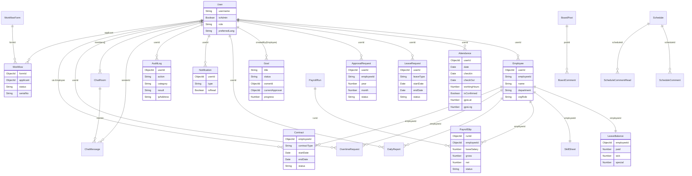

# 20. ER 図（エンティティ関係図）

定義ファイル: `models/index.js`（1580行、43モデル）

Mermaid erDiagram 記法で主要関係を示す。補助テーブル（UserBehaviorLog 等）は省略。

---

---

## 主要リレーション一覧

| 親モデル        | 子モデル        | 結合キー                   | カーディナリティ |
| --------------- | --------------- | -------------------------- | ---------------- |
| User            | Employee        | Employee.userId            | 1:1              |
| User            | Attendance      | Attendance.userId          | 1:N              |
| User            | LeaveRequest    | LeaveRequest.userId        | 1:N              |
| User            | ApprovalRequest | ApprovalRequest.userId     | 1:N              |
| User            | DailyReport     | DailyReport.userId         | 1:N              |
| User            | Notification    | Notification.userId        | 1:N              |
| User            | AuditLog        | AuditLog.userId            | 1:N              |
| User            | OvertimeRequest | OvertimeRequest.userId     | 1:N              |
| User            | Workflow        | Workflow.applicant         | 1:N              |
| Employee        | LeaveBalance    | LeaveBalance.employeeId    | 1:1              |
| Employee        | SkillSheet      | SkillSheet.employeeId      | 1:1              |
| Employee        | PayrollSlip     | PayrollSlip.employeeId     | 1:N              |
| Employee        | Contract        | Contract.employeeId        | 1:N              |
| PayrollRun      | PayrollSlip     | PayrollSlip.runId          | 1:N              |
| BoardPost       | BoardComment    | BoardComment.postId        | 1:N              |
| ChatRoom        | ChatMessage     | ChatMessage.roomId         | 1:N              |
| WorkflowForm    | Workflow        | Workflow.formId            | 1:N              |
| Schedule        | ScheduleComment | ScheduleComment.scheduleId | 1:N              |
| User ↔ ChatRoom | —               | ChatRoom.members[]         | N:M              |
| User ↔ Schedule | —               | Schedule.attendees[]       | N:M              |
