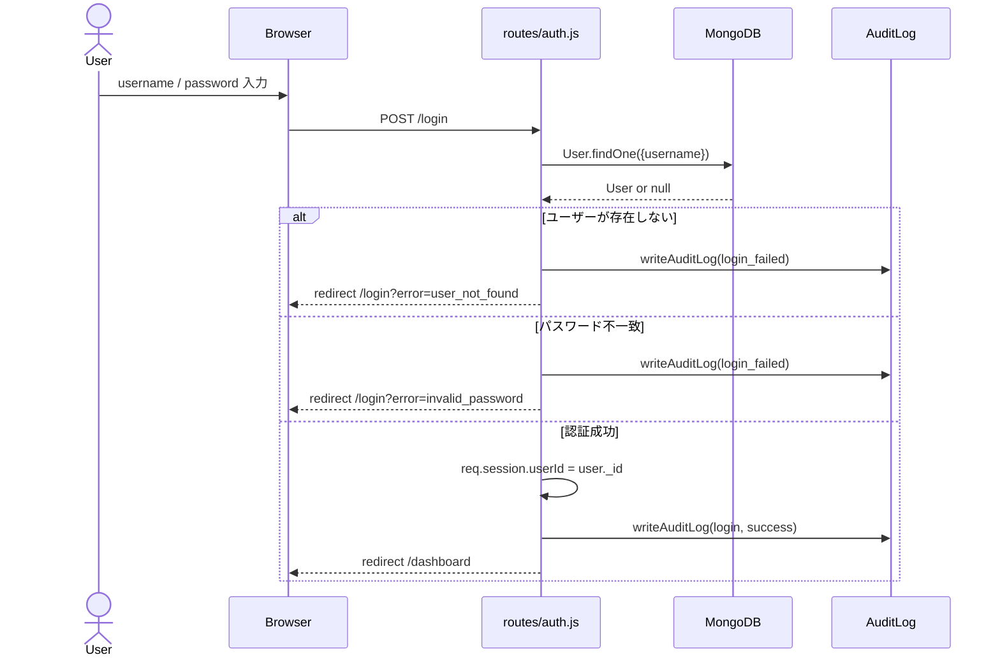
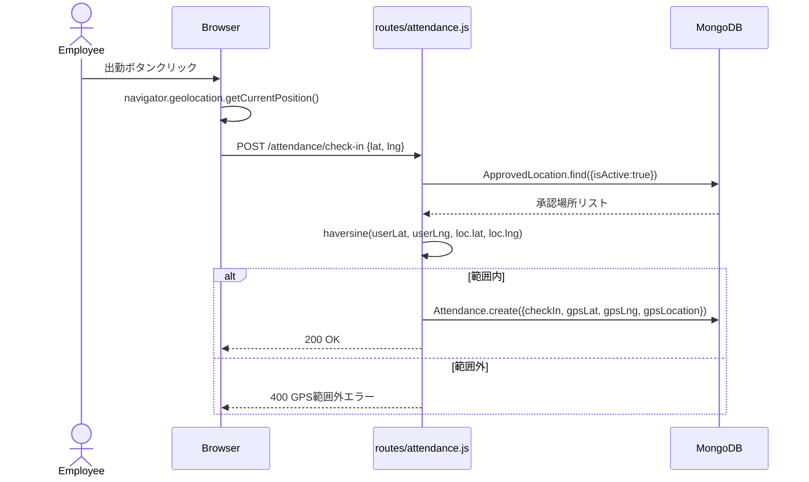
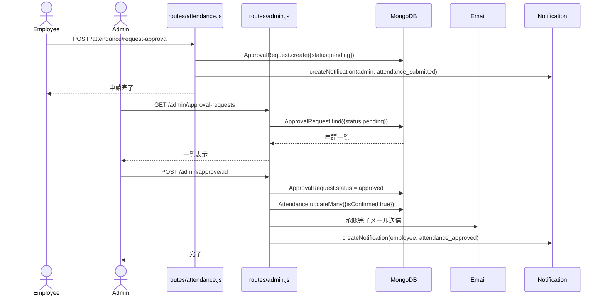
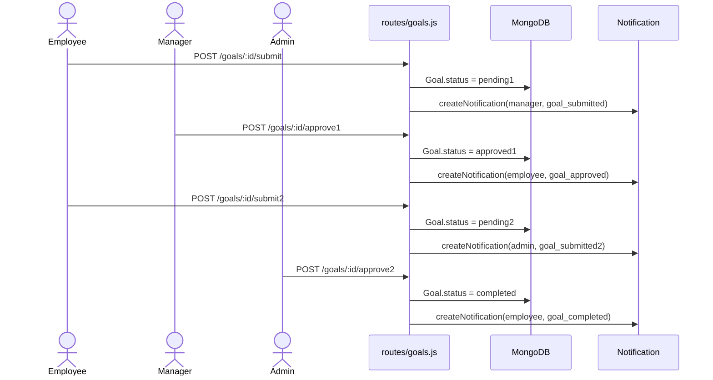
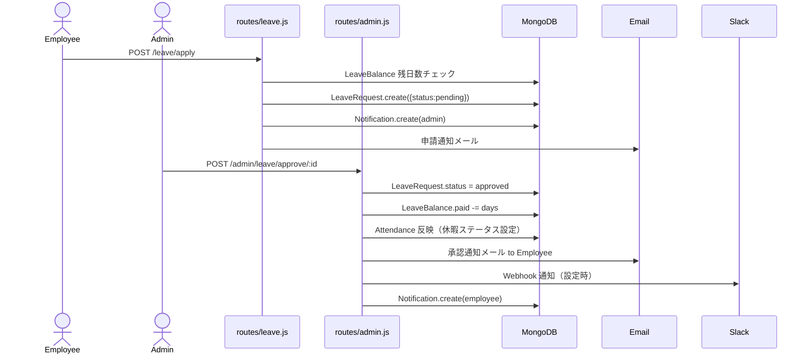
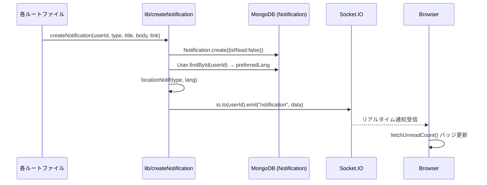

# 24. シーケンス図

主要業務フローのシーケンスを Mermaid sequenceDiagram 形式で示す。

---

## 1. ログインシーケンス

---

## 2. GPS 打刻シーケンス（出勤）

---

## 3. 月次承認シーケンス

---

## 4. 目標承認シーケンス（2段階）

---

## 5. 休暇承認シーケンス

---

## 6. 通知配信シーケンス（Socket.IO）

