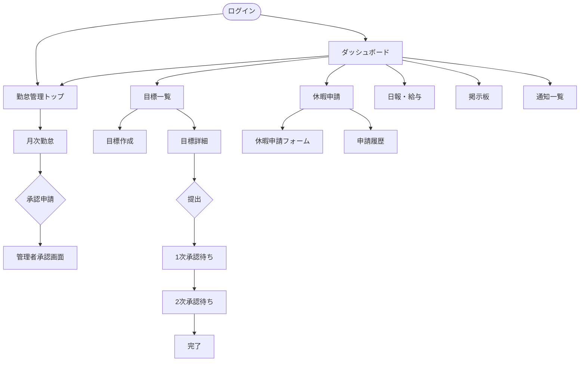
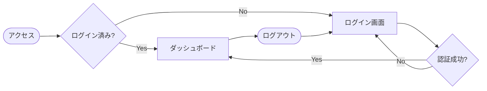
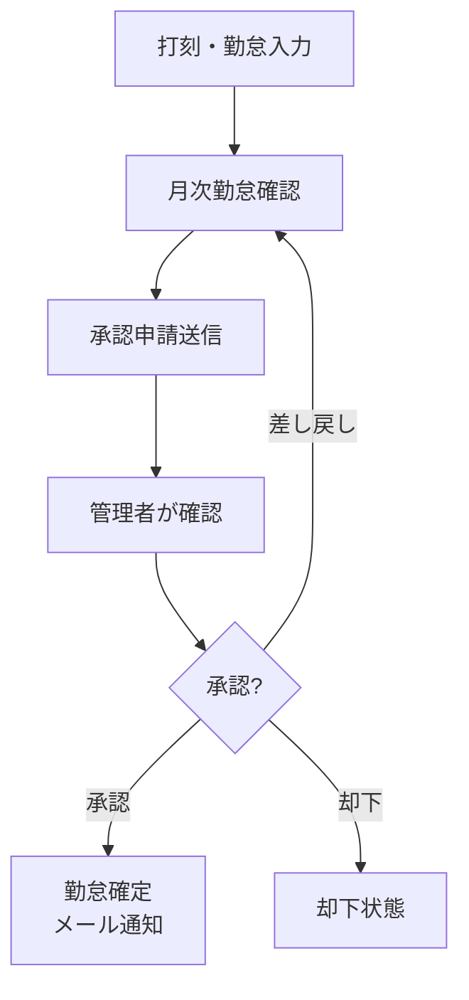
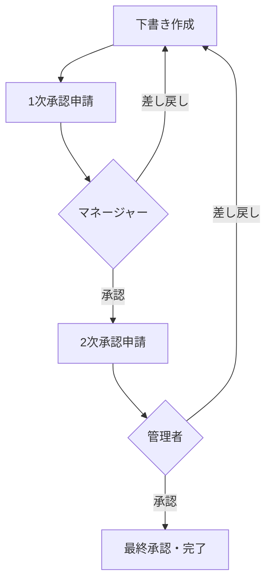
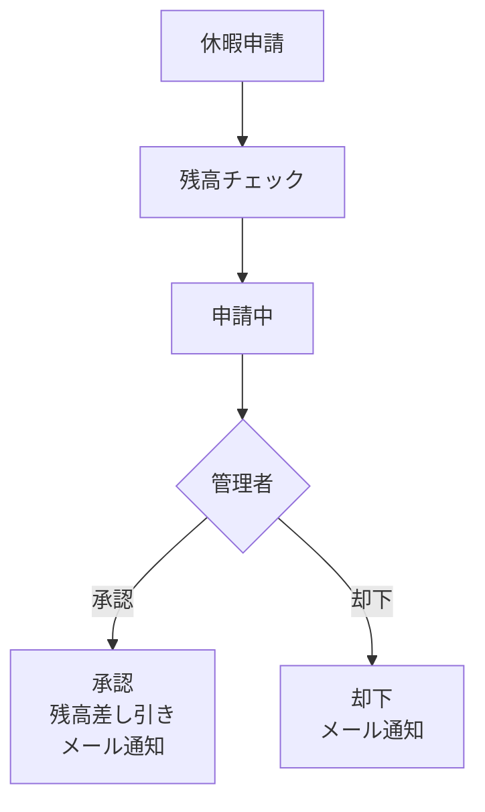
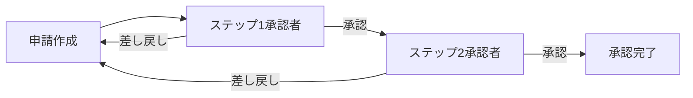

# BD-03. 画面遷移図

---

## 1. 全体遷移図

```mermaid
flowchart TD
    Login([ログイン]) --> Dashboard[ダッシュボード]
    Login --> AttMain[勤怠管理トップ]

    Dashboard --> AttMain
    Dashboard --> Goals[目標一覧]
    Dashboard --> Leave[休暇申請]
    Dashboard --> HR[日報・給与]
    Dashboard --> Board[掲示板]
    Dashboard --> Notif[通知一覧]

    AttMain --> Monthly[月次勤怠]
    Monthly --> ApprReq{承認申請}
    ApprReq --> Admin[管理者承認画面]

    Goals --> GoalNew[目標作成]
    Goals --> GoalDetail[目標詳細]
    GoalDetail --> GoalSubmit{提出}
    GoalSubmit --> Approve1[1次承認待ち]
    Approve1 --> Approve2[2次承認待ち]
    Approve2 --> Completed[完了]

    Leave --> LeaveApply[休暇申請フォーム]
    Leave --> LeaveHistory[申請履歴]
```

---

## 2. 認証フロー

```mermaid
flowchart LR
    Start([アクセス]) --> Auth{ログイン済み?}
    Auth -->|Yes| Dashboard[ダッシュボード]
    Auth -->|No| Login[ログイン画面]
    Login --> InputOK{認証成功?}
    InputOK -->|Yes| Dashboard
    InputOK -->|No| Login
    Dashboard --> Logout([ログアウト]) --> Login
```

---

## 3. 勤怠承認フロー

```mermaid
flowchart TD
    Punch[打刻・勤怠入力] --> Monthly[月次勤怠確認]
    Monthly --> Request[承認申請送信]
    Request --> AdminCheck[管理者が確認]
    AdminCheck --> ApproveOK{承認?}
    ApproveOK -->|承認| Confirmed[勤怠確定
メール通知]
    ApproveOK -->|差し戻し| Monthly
    ApproveOK -->|却下| Rejected[却下状態]
```

---

## 4. 目標管理フロー

```mermaid
flowchart TD
    Draft[下書き作成] --> Submit1[1次承認申請]
    Submit1 --> Manager{マネージャー}
    Manager -->|承認| Submit2[2次承認申請]
    Manager -->|差し戻し| Draft
    Submit2 --> AdminGoal{管理者}
    AdminGoal -->|承認| Done[最終承認・完了]
    AdminGoal -->|差し戻し| Draft
```

---

## 5. 休暇申請フロー

```mermaid
flowchart TD
    Apply[休暇申請] --> Check[残高チェック]
    Check --> Pending[申請中]
    Pending --> Admin{管理者}
    Admin -->|承認| Approved[承認
残高差し引き
メール通知]
    Admin -->|却下| Rejected[却下
メール通知]
```

---

## 6. ワークフロー汎用フロー

```mermaid
flowchart LR
    NewApp[申請作成] --> Step1[ステップ1承認者]
    Step1 -->|承認| Step2[ステップ2承認者]
    Step1 -->|差し戻し| NewApp
    Step2 -->|承認| Final[承認完了]
    Step2 -->|差し戻し| NewApp
```