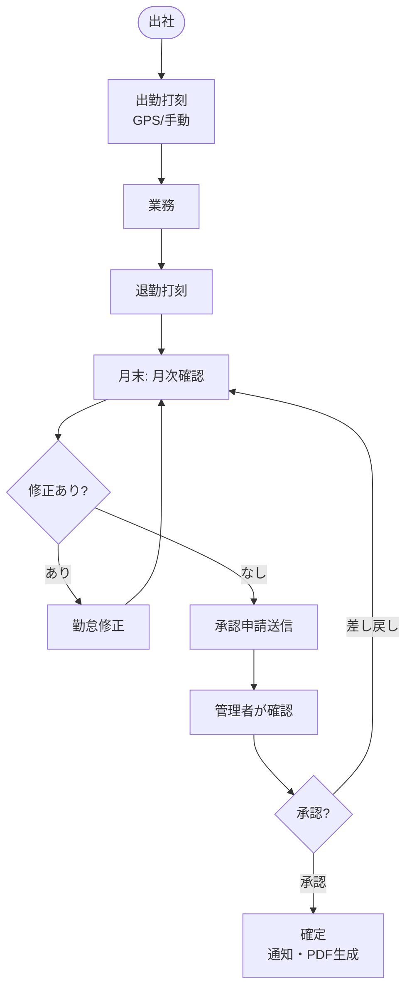
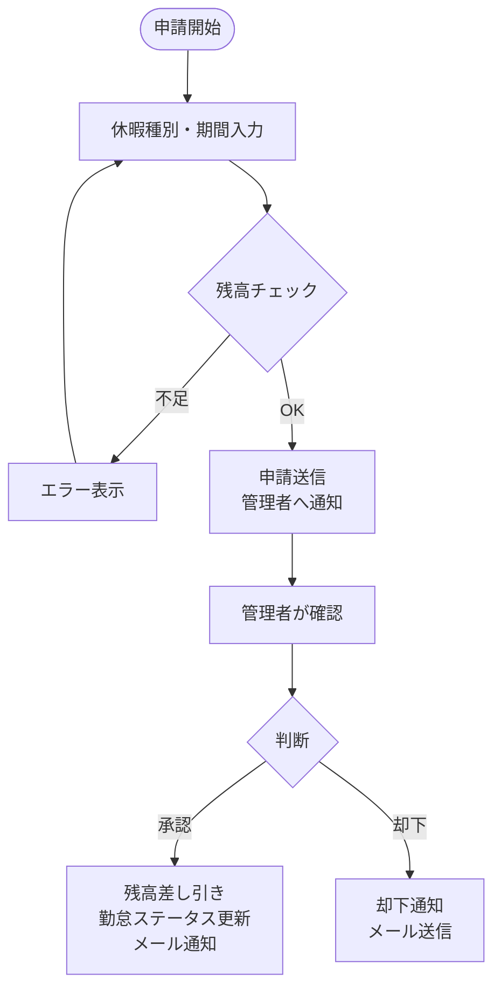
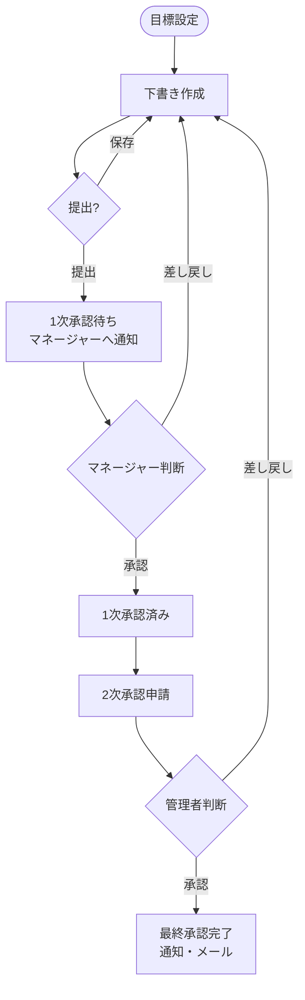
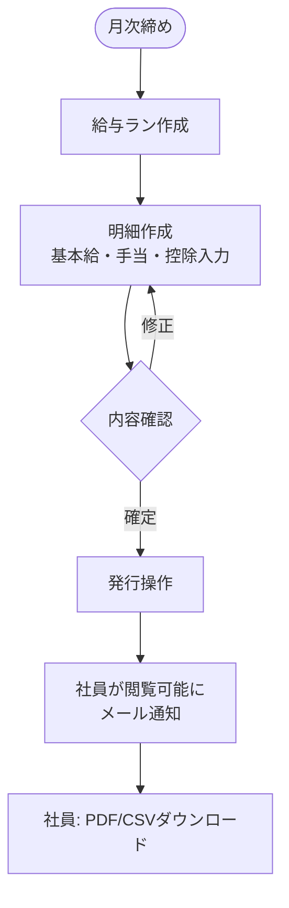
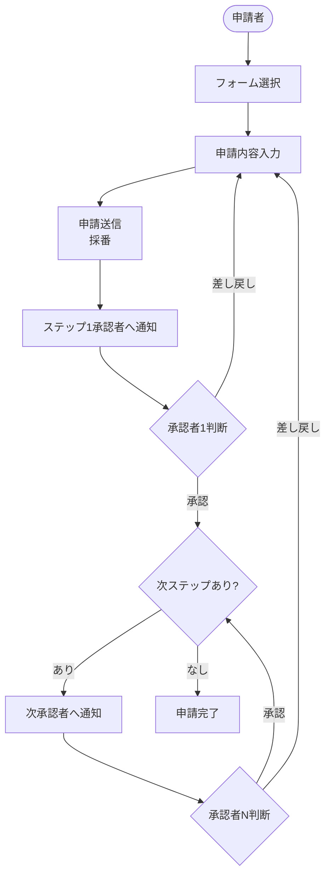
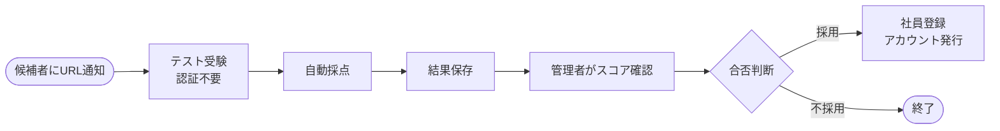

# BD-08. 業務フロー図

各業務の流れを Mermaid flowchart 形式で示す。

---

## 1. 勤怠管理業務フロー

---

## 2. 休暇申請業務フロー

---

## 3. 目標管理業務フロー

---

## 4. 給与発行業務フロー

---

## 5. ワークフロー業務フロー

---

## 6. 新入社員受け入れフロー（入社前テスト）

