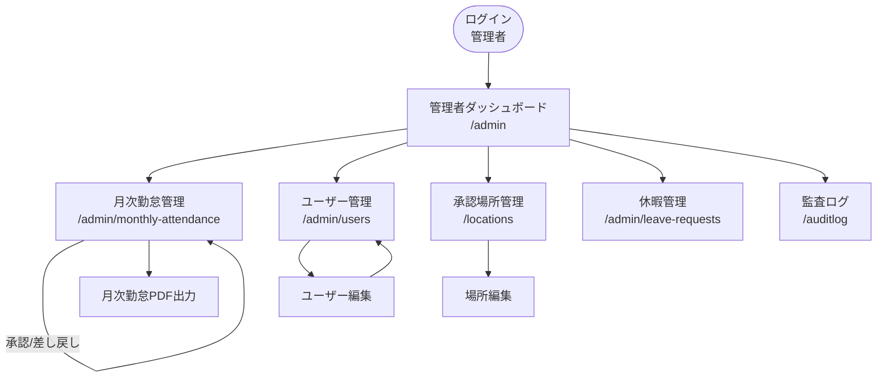

# 管理者機能 - 画面遷移図

```mermaid
flowchart TD
    Login([ログイン
管理者]) --> AdminDash[管理者ダッシュボード
/admin]
    AdminDash --> MonthlyAtt[月次勤怠管理
/admin/monthly-attendance]
    AdminDash --> UserMgmt[ユーザー管理
/admin/users]
    AdminDash --> LocationMgmt[承認場所管理
/locations]
    AdminDash --> LeaveAdmin[休暇管理
/admin/leave-requests]
    AdminDash --> AuditLog[監査ログ
/auditlog]
    MonthlyAtt -->|承認/差し戻し| MonthlyAtt
    MonthlyAtt --> AttPDF[月次勤怠PDF出力]
    UserMgmt --> UserEdit[ユーザー編集]
    UserEdit --> UserMgmt
    LocationMgmt --> LocationEdit[場所編集]
```