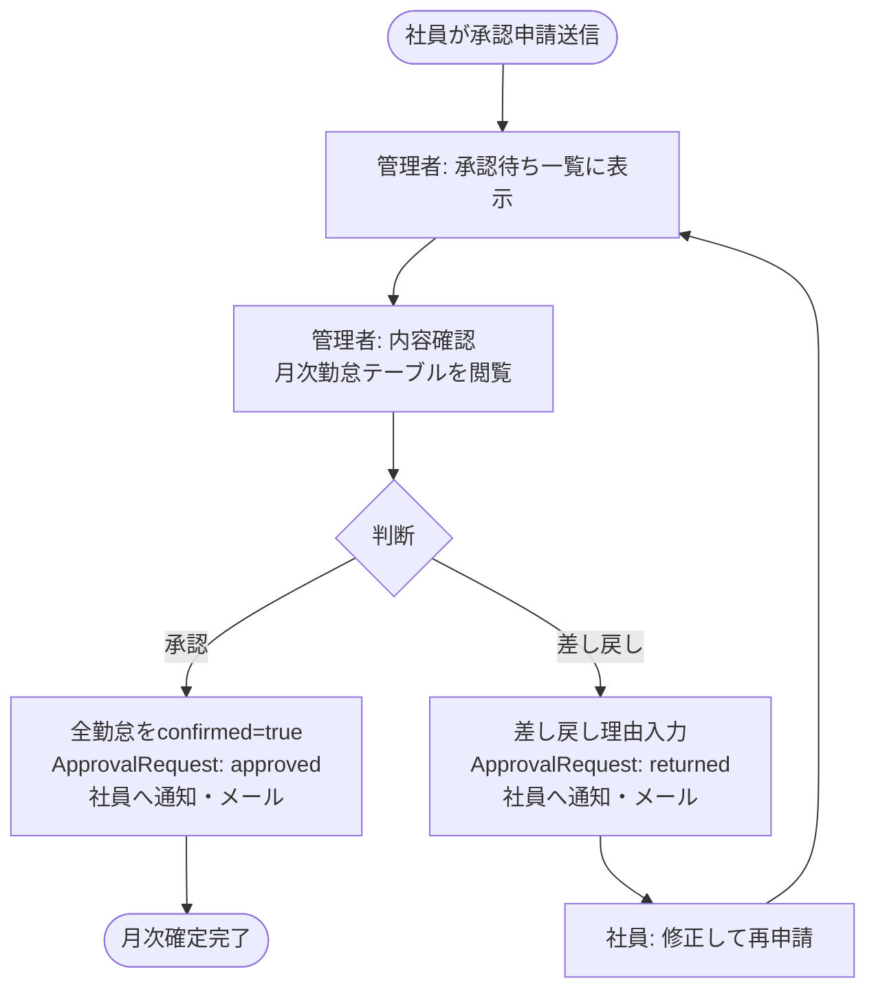

# 管理者機能 - 業務フロー図

## 月次勤怠承認フロー

```mermaid
flowchart TD
    A([社員が承認申請送信]) --> B[管理者: 承認待ち一覧に表示]
    B --> C[管理者: 内容確認
月次勤怠テーブルを閲覧]
    C --> D{判断}
    D -->|承認| E[全勤怠をconfirmed=true
ApprovalRequest: approved
社員へ通知・メール]
    D -->|差し戻し| F[差し戻し理由入力
ApprovalRequest: returned
社員へ通知・メール]
    F --> G[社員: 修正して再申請]
    G --> B
    E --> H([月次確定完了])
```