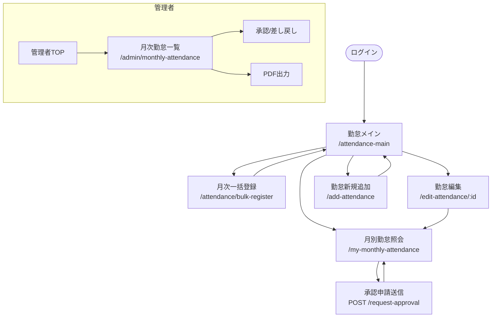

# 勤怠管理 - 画面遷移図

### 遷移条件
| 遷移元 | 遷移先 | 条件 |
|--------|--------|------|
| ログイン画面 | 勤怠メイン | ログイン成功 |
| 勤怠メイン | 月次一括登録 | 「月次入力」ボタン押下 |
| 勤怠メイン | 月別照会 | 「月別確認」ボタン押下 |
| 月別照会 | 承認申請 | 「承認申請」ボタン押下（未申請時のみ） |
| 勤怠メイン | 勤怠編集 | 該当日の「編集」アイコン押下 |