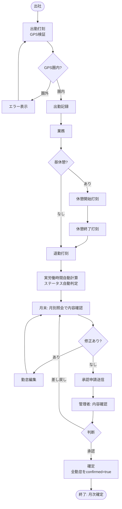

# 勤怠管理 - 業務フロー図

```mermaid
flowchart TD
    A([出社]) --> B[出勤打刻
GPS検証]
    B --> C{GPS圏内?}
    C -->|圏外| D[エラー表示]
    D --> B
    C -->|圏内| E[出勤記録]
    E --> F[業務]
    F --> G{昼休憩?}
    G -->|あり| H[休憩開始打刻]
    H --> I[休憩終了打刻]
    I --> J[退勤打刻]
    G -->|なし| J
    J --> K[実労働時間自動計算
ステータス自動判定]
    K --> L[月末: 月別照会で内容確認]
    L --> M{修正あり?}
    M -->|あり| N[勤怠編集]
    N --> L
    M -->|なし| O[承認申請送信]
    O --> P[管理者: 内容確認]
    P --> Q{判断}
    Q -->|承認| R[確定
全勤怠をconfirmed=true]
    Q -->|差し戻し| L
    R --> S([終了: 月次確定])
```