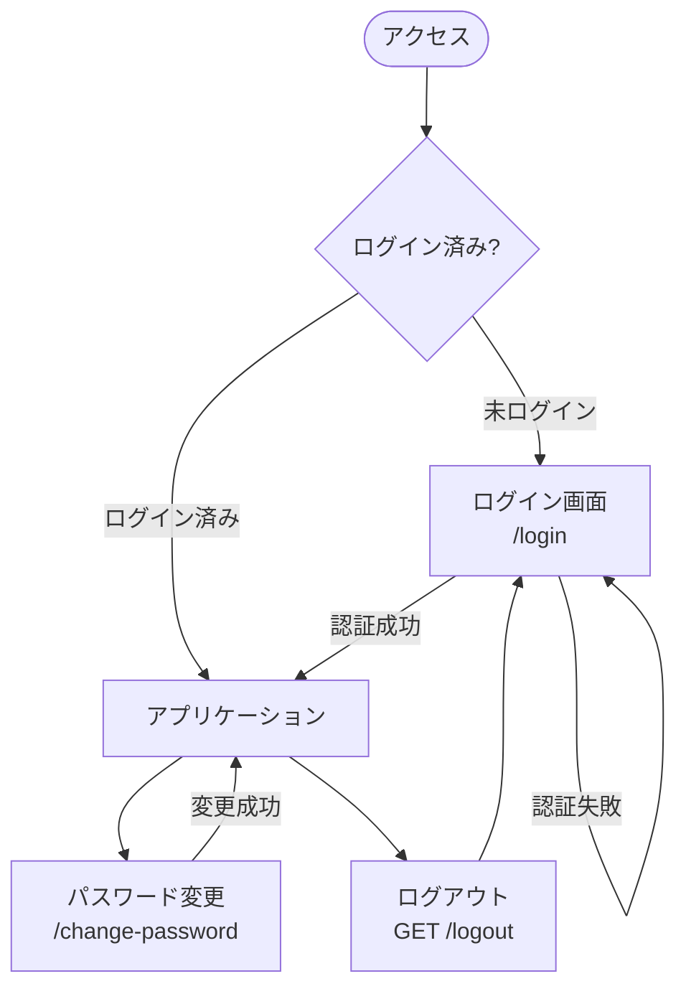

# 認証 - 画面遷移図

```mermaid
flowchart TD
    Start([アクセス]) --> Auth{ログイン済み?}
    Auth -->|未ログイン| Login[ログイン画面
/login]
    Auth -->|ログイン済み| App[アプリケーション]
    Login -->|認証成功| App
    Login -->|認証失敗| Login
    App --> ChangePW[パスワード変更
/change-password]
    ChangePW -->|変更成功| App
    App --> Logout[ログアウト
GET /logout]
    Logout --> Login
```

### 遷移条件
| 遷移元 | 遷移先 | 条件 |
|--------|--------|------|
| 未認証アクセス | ログイン画面 | セッションなし |
| ログイン画面 | アプリ | 認証成功 |
| ログイン画面 | ログイン画面 | 認証失敗（エラー表示） |
| アプリ | ログイン画面 | ログアウト操作 |