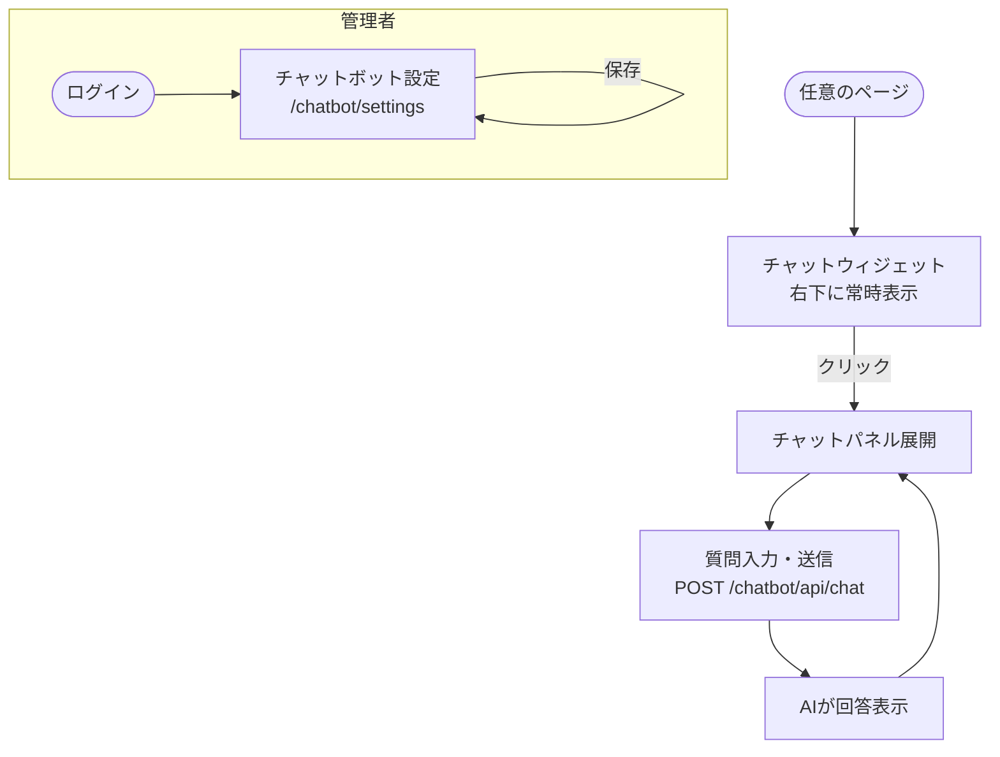

# AIチャットボット - 画面遷移図

```mermaid
flowchart TD
    AnyPage([任意のページ]) --> Widget[チャットウィジェット
右下に常時表示]
    Widget -->|クリック| ChatPanel[チャットパネル展開]
    ChatPanel --> SendMsg[質問入力・送信
POST /chatbot/api/chat]
    SendMsg --> AIResp[AIが回答表示]
    AIResp --> ChatPanel
    subgraph 管理者
    Login([ログイン]) --> Settings[チャットボット設定
/chatbot/settings]
    Settings -->|保存| Settings
    end
```