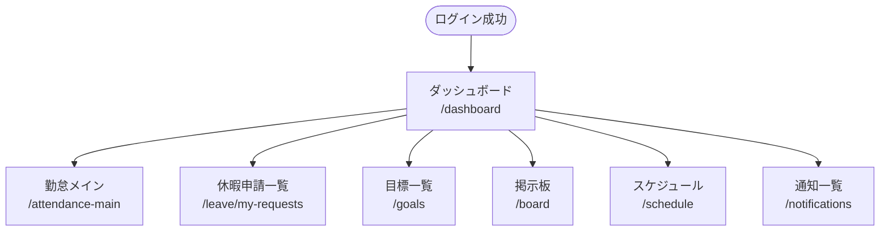

# ダッシュボード - 画面遷移図

```mermaid
flowchart TD
    Login([ログイン成功]) --> Dashboard[ダッシュボード
/dashboard]
    Dashboard --> Attendance[勤怠メイン
/attendance-main]
    Dashboard --> MyLeave[休暇申請一覧
/leave/my-requests]
    Dashboard --> Goals[目標一覧
/goals]
    Dashboard --> Board[掲示板
/board]
    Dashboard --> Schedule[スケジュール
/schedule]
    Dashboard --> Notifications[通知一覧
/notifications]
```