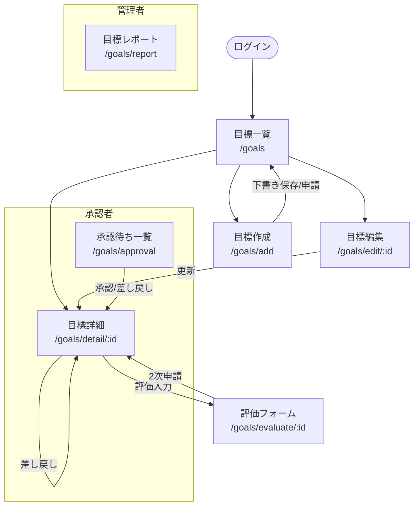

# 目標管理 - 画面遷移図

### 遷移条件
| 遷移元 | 遷移先 | 条件 |
|--------|--------|------|
| 目標一覧 | 目標作成 | 「新規作成」ボタン押下 |
| 目標一覧 | 目標詳細 | カード押下 |
| 目標詳細 | 評価フォーム | approved1 状態 + 作成者本人 |
| 目標詳細 | 承認操作 | pending1/pending2 状態 + 承認者/管理者 |