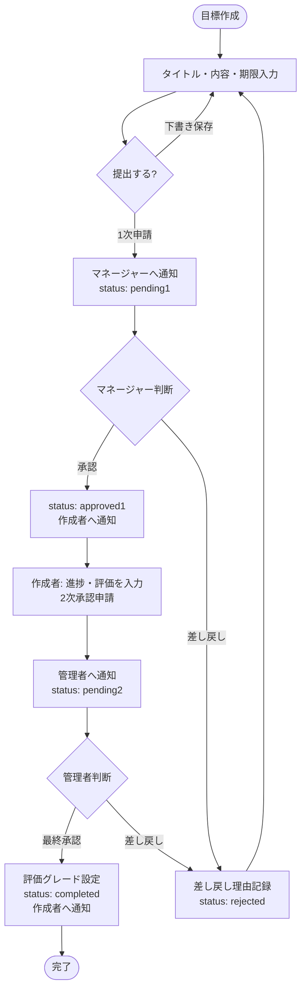

# 目標管理 - 業務フロー図

```mermaid
flowchart TD
    A([目標作成]) --> B[タイトル・内容・期限入力]
    B --> C{提出する?}
    C -->|下書き保存| B
    C -->|1次申請| D[マネージャーへ通知
status: pending1]
    D --> E{マネージャー判断}
    E -->|承認| F[status: approved1
作成者へ通知]
    E -->|差し戻し| G[差し戻し理由記録
status: rejected]
    G --> B
    F --> H[作成者: 進捗・評価を入力
2次承認申請]
    H --> I[管理者へ通知
status: pending2]
    I --> J{管理者判断}
    J -->|最終承認| K[評価グレード設定
status: completed
作成者へ通知]
    J -->|差し戻し| G
    K --> L([完了])
```