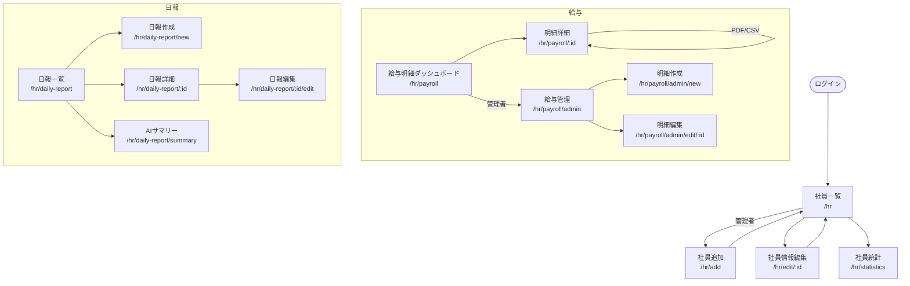

# 人事・給与・日報 - 画面遷移図

```mermaid
flowchart TD
    Login([ログイン]) --> HRList[社員一覧
/hr]
    HRList -->|管理者| AddEmp[社員追加
/hr/add]
    HRList --> EditEmp[社員情報編集
/hr/edit/:id]
    HRList --> Statistics[社員統計
/hr/statistics]
    AddEmp --> HRList
    EditEmp --> HRList
    subgraph 給与
    PayDash[給与明細ダッシュボード
/hr/payroll] --> PayDetail[明細詳細
/hr/payroll/:id]
    PayDetail -->|PDF/CSV| PayDetail
    PayDash -->|管理者| AdminPay[給与管理
/hr/payroll/admin]
    AdminPay --> NewSlip[明細作成
/hr/payroll/admin/new]
    AdminPay --> EditSlip[明細編集
/hr/payroll/admin/edit/:id]
    end
    subgraph 日報
    DRList[日報一覧
/hr/daily-report] --> DRNew[日報作成
/hr/daily-report/new]
    DRList --> DRDetail[日報詳細
/hr/daily-report/:id]
    DRDetail --> DREdit[日報編集
/hr/daily-report/:id/edit]
    DRList --> DRSummary[AIサマリー
/hr/daily-report/summary]
    end
```