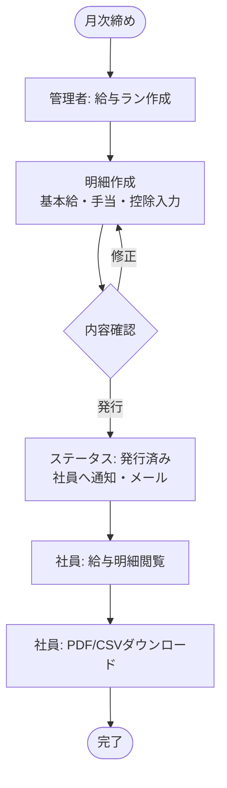
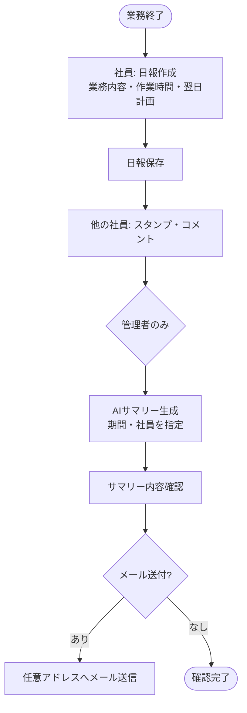

# 人事・給与・日報 - 業務フロー図

## 給与発行フロー

```mermaid
flowchart TD
    A([月次締め]) --> B[管理者: 給与ラン作成]
    B --> C[明細作成
基本給・手当・控除入力]
    C --> D{内容確認}
    D -->|修正| C
    D -->|発行| E[ステータス: 発行済み
社員へ通知・メール]
    E --> F[社員: 給与明細閲覧]
    F --> G[社員: PDF/CSVダウンロード]
    G --> H([完了])
```

## 日報フロー

```mermaid
flowchart TD
    A([業務終了]) --> B[社員: 日報作成
業務内容・作業時間・翌日計画]
    B --> C[日報保存]
    C --> D[他の社員: スタンプ・コメント]
    D --> E{管理者のみ}
    E --> F[AIサマリー生成
期間・社員を指定]
    F --> G[サマリー内容確認]
    G --> H{メール送付?}
    H -->|あり| I[任意アドレスへメール送信]
    H -->|なし| J([確認完了])
```