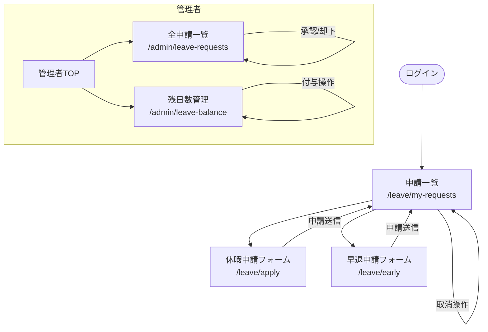

# 休暇申請 - 画面遷移図

### 遷移条件
| 遷移元 | 遷移先 | 条件 |
|--------|--------|------|
| 申請一覧 | 休暇申請フォーム | 「申請する」ボタン押下 |
| 申請一覧 | 早退申請フォーム | 「早退申請」ボタン押下 |
| 休暇申請フォーム | 申請一覧 | 申請送信成功 |
| 申請一覧 | 申請一覧 | 「取消」ボタン押下（pending のみ） |