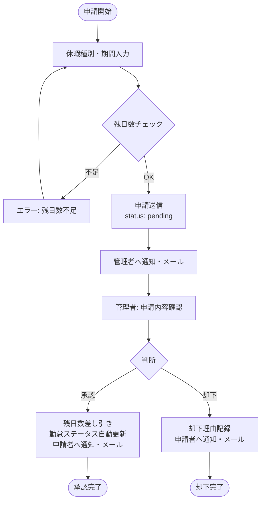

# 休暇申請 - 業務フロー図

```mermaid
flowchart TD
    A([申請開始]) --> B[休暇種別・期間入力]
    B --> C{残日数チェック}
    C -->|不足| D[エラー: 残日数不足]
    D --> B
    C -->|OK| E[申請送信
status: pending]
    E --> F[管理者へ通知・メール]
    F --> G[管理者: 申請内容確認]
    G --> H{判断}
    H -->|承認| I[残日数差し引き
勤怠ステータス自動更新
申請者へ通知・メール]
    H -->|却下| J[却下理由記録
申請者へ通知・メール]
    I --> K([承認完了])
    J --> L([却下完了])
```