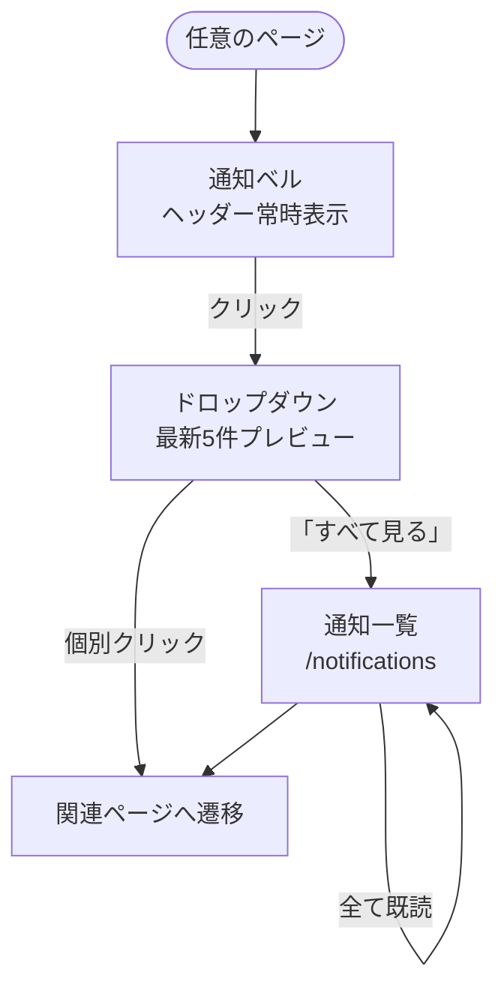

# 通知システム - 画面遷移図

```mermaid
flowchart TD
    AnyPage([任意のページ]) --> Bell[通知ベル
ヘッダー常時表示]
    Bell -->|クリック| Dropdown[ドロップダウン
最新5件プレビュー]
    Dropdown -->|「すべて見る」| NotifList[通知一覧
/notifications]
    Dropdown -->|個別クリック| TargetPage[関連ページへ遷移]
    NotifList -->|既読操作| NotifList
    NotifList -->|全て既読| NotifList
    NotifList --> TargetPage
```