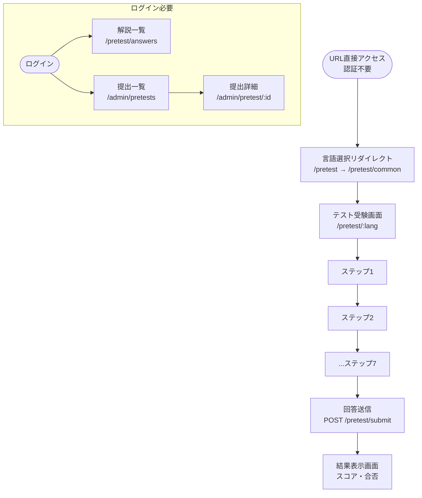

# 入社前テスト - 画面遷移図

```mermaid
flowchart TD
    URL([URL直接アクセス
認証不要]) --> Lang[言語選択リダイレクト
/pretest → /pretest/common]
    Lang --> Test[テスト受験画面
/pretest/:lang]
    Test --> Step1[ステップ1]
    Step1 --> Step2[ステップ2]
    Step2 --> StepN[...ステップ7]
    StepN --> Submit[回答送信
POST /pretest/submit]
    Submit --> Result[結果表示画面
スコア・合否]
    subgraph ログイン必要
    Login([ログイン]) --> Answers[解説一覧
/pretest/answers]
    Login --> AdminList[提出一覧
/admin/pretests]
    AdminList --> AdminDetail[提出詳細
/admin/pretest/:id]
    end
```