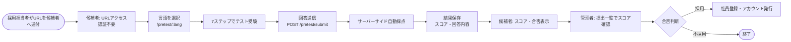

# 入社前テスト - 業務フロー図

```mermaid
flowchart LR
    A([採用担当者がURLを候補者へ送付]) --> B[候補者: URLアクセス
認証不要]
    B --> C[言語を選択
/pretest/:lang]
    C --> D[7ステップでテスト受験]
    D --> E[回答送信
POST /pretest/submit]
    E --> F[サーバーサイド自動採点]
    F --> G[結果保存
スコア・回答内容]
    G --> H[候補者: スコア・合否表示]
    H --> I[管理者: 提出一覧でスコア確認]
    I --> J{合否判断}
    J -->|採用| K[社員登録・アカウント発行]
    J -->|不採用| L([終了])
```