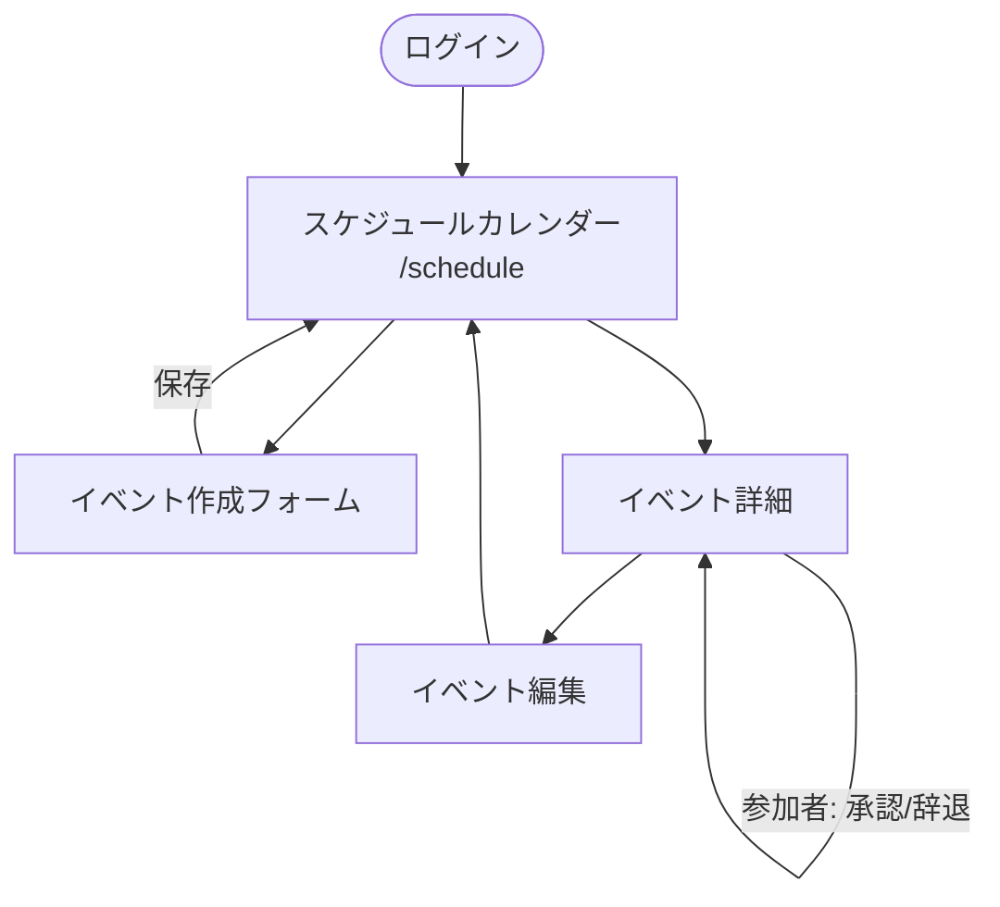

# スケジューラ - 画面遷移図

```mermaid
flowchart TD
    Login([ログイン]) --> ScheduleCal[スケジュールカレンダー
/schedule]
    ScheduleCal --> NewEvent[イベント作成フォーム]
    NewEvent -->|保存| ScheduleCal
    ScheduleCal --> EventDetail[イベント詳細]
    EventDetail --> EditEvent[イベント編集]
    EditEvent --> ScheduleCal
    EventDetail -->|参加者: 承認/辞退| EventDetail
```