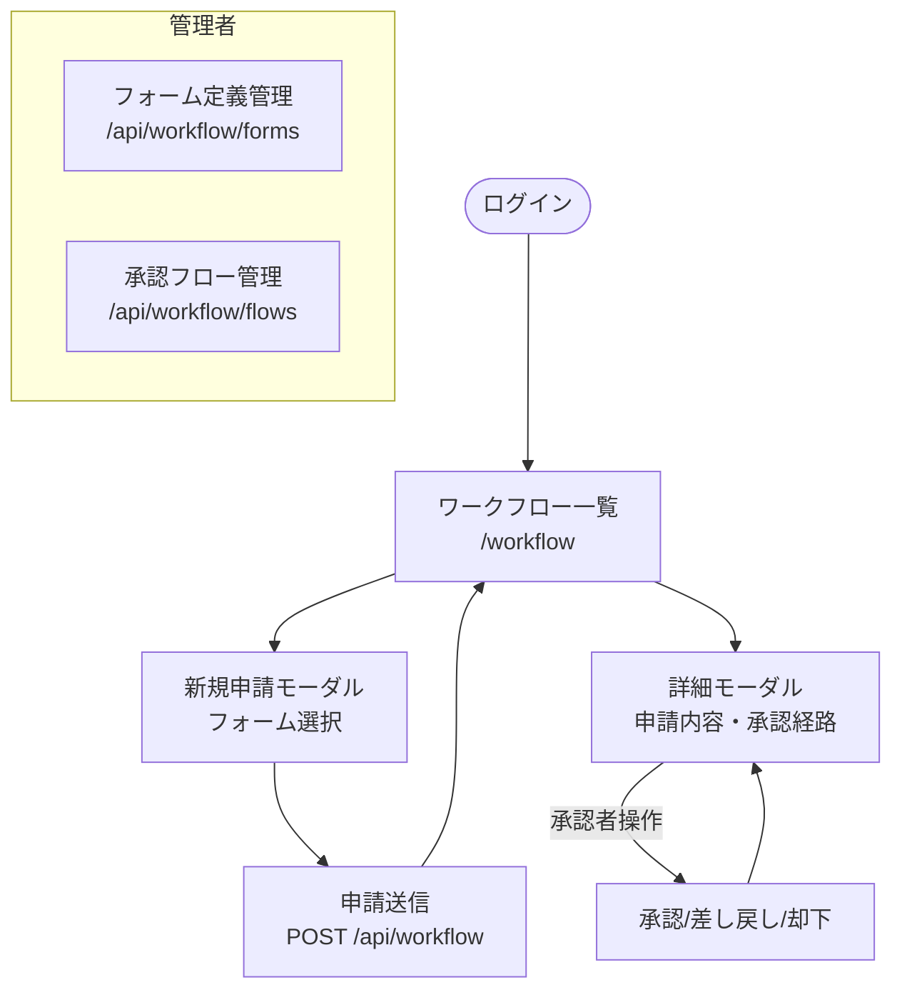

# ワークフロー - 画面遷移図

```mermaid
flowchart TD
    Login([ログイン]) --> WFList[ワークフロー一覧
/workflow]
    WFList --> NewModal[新規申請モーダル
フォーム選択]
    NewModal --> Submit[申請送信
POST /api/workflow]
    Submit --> WFList
    WFList --> DetailModal[詳細モーダル
申請内容・承認経路]
    DetailModal -->|承認者操作| Approve[承認/差し戻し/却下]
    Approve --> DetailModal
    subgraph 管理者
    AdminForms[フォーム定義管理
/api/workflow/forms]
    AdminFlows[承認フロー管理
/api/workflow/flows]
    end
```

### 遷移条件
| 遷移元 | 遷移先 | 条件 |
|--------|--------|------|
| 一覧 | 新規申請モーダル | 「新規申請」ボタン押下 |
| 一覧 | 詳細モーダル | 申請行の「詳細」押下 |
| 詳細モーダル | 承認操作 | 承認者権限あり + pending状態 |