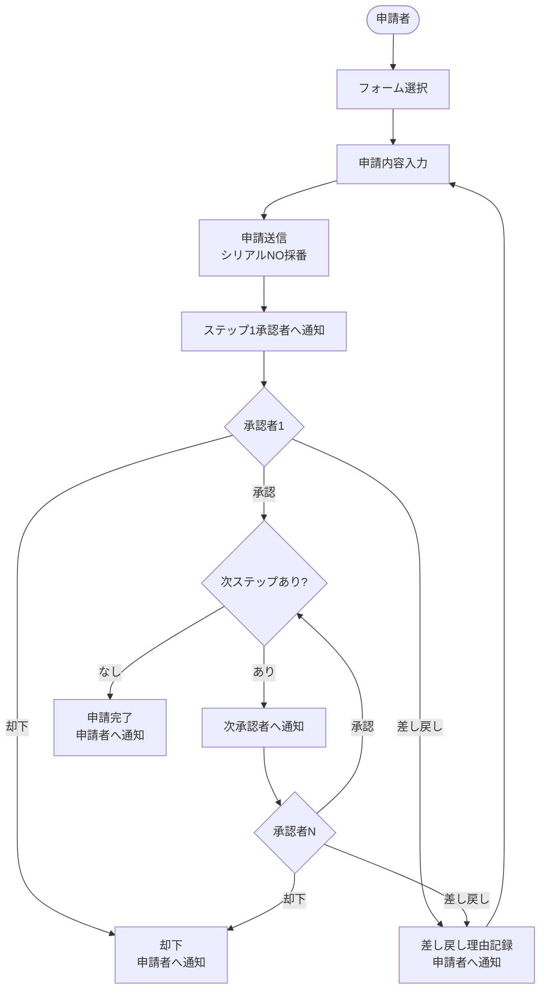

# ワークフロー - 業務フロー図

```mermaid
flowchart TD
    A([申請者]) --> B[フォーム選択]
    B --> C[申請内容入力]
    C --> D[申請送信
シリアルNO採番]
    D --> E[ステップ1承認者へ通知]
    E --> F{承認者1}
    F -->|承認| G{次ステップあり?}
    F -->|差し戻し| H[差し戻し理由記録
申請者へ通知]
    H --> C
    F -->|却下| I[却下
申請者へ通知]
    G -->|あり| J[次承認者へ通知]
    J --> K{承認者N}
    K -->|承認| G
    K -->|差し戻し| H
    K -->|却下| I
    G -->|なし| L[申請完了
申請者へ通知]
```