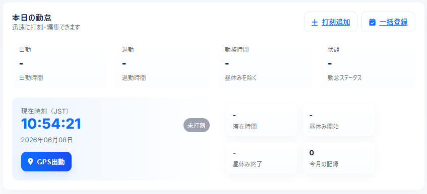
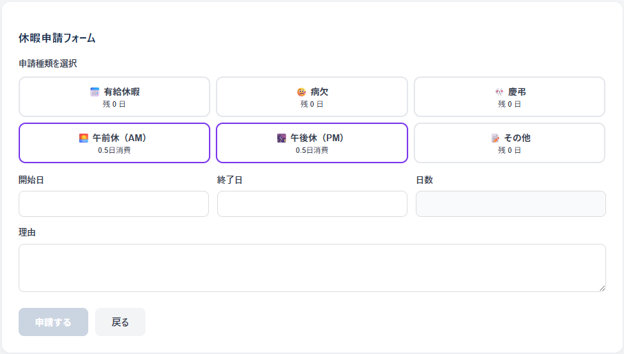
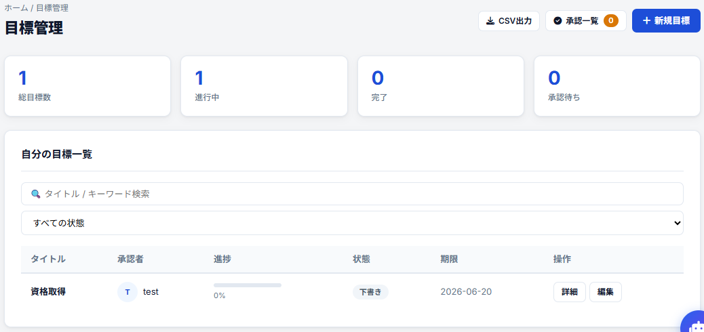
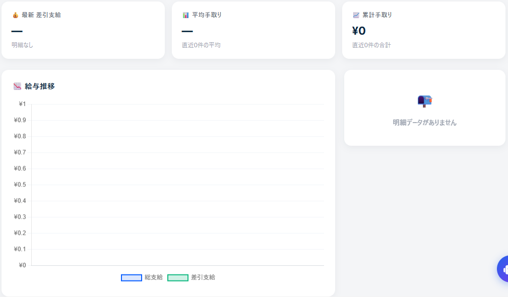
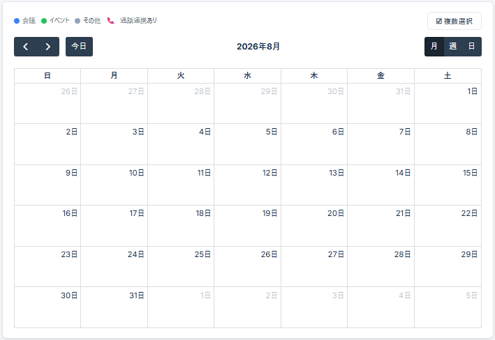
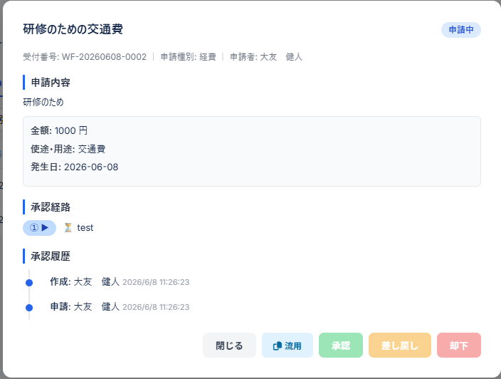
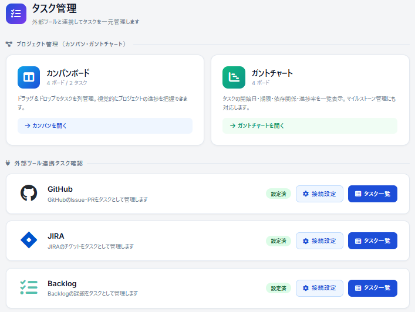
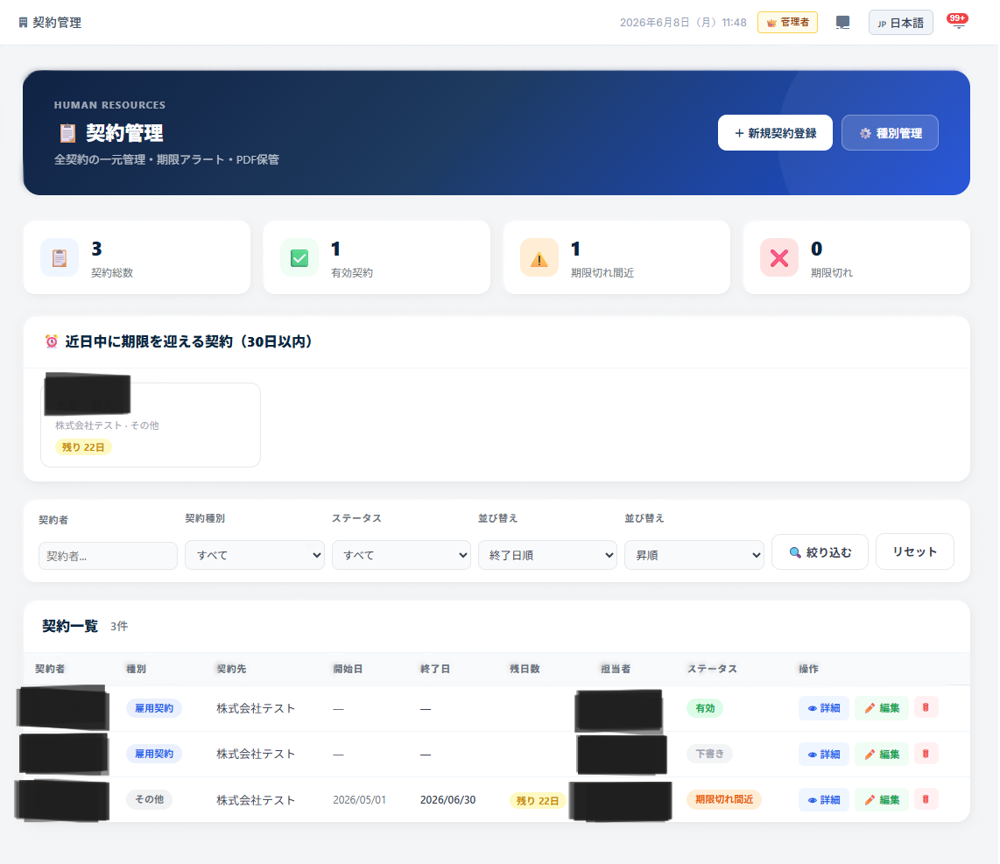
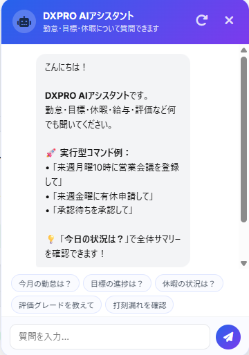

<a id="nokori-勤怠管理システム--一般ユーザー向け操作マニュアル"></a>
# NOKORI 勤怠管理システム <br> 一般ユーザー向け操作マニュアル

> 作成日: 2026-07-29<br>
> 対象読者: 一般社員（管理者以外の全ユーザー）<br>
> このマニュアルは「何をするための画面か」「どう操作するか」を中心に、専門用語をできるだけ使わずに説明しま  す。

---

<a id="目次"></a>
## 目次

- [NOKORI 勤怠管理システム  一般ユーザー向け操作マニュアル](#nokori-勤怠管理システム--一般ユーザー向け操作マニュアル)
  - [目次](#目次)
  - [1. はじめに（ログイン方法）](#1-はじめにログイン方法)
  - [2. 画面の基本の見方](#2-画面の基本の見方)
    - [2-1. ログイン後のトップ画面（ダッシュボード）](#2-1-ログイン後のトップ画面ダッシュボード)
    - [2-2. 半期評価に対する自己申告（フィードバック）を提出する](#2-2-半期評価に対する自己申告フィードバックを提出する)
  - [3. 出勤・退勤の打刻をする](#3-出勤退勤の打刻をする)
    - [3-1. 出勤打刻をする](#3-1-出勤打刻をする)
    - [3-2. 昼休憩の開始・終了を打刻する](#3-2-昼休憩の開始終了を打刻する)
    - [3-3. 退勤打刻をする](#3-3-退勤打刻をする)
    - [3-4. 今月のサマリーを確認する](#3-4-今月のサマリーを確認する)
    - [3-5. 位置情報（GPS）に関する注意点](#3-5-位置情報gpsに関する注意点)
    - [3-6. 打刻を間違えた・忘れた場合](#3-6-打刻を間違えた忘れた場合)
  - [4. 今月の勤怠を確認する](#4-今月の勤怠を確認する)
    - [4-1. 月別の勤怠一覧を見る](#4-1-月別の勤怠一覧を見る)
    - [4-2. 打刻の間違い・漏れを修正する](#4-2-打刻の間違い漏れを修正する)
    - [4-3. 月次の承認申請を出す](#4-3-月次の承認申請を出す)
    - [4-4. 勤怠表をPDFで保存する](#4-4-勤怠表をpdfで保存する)
    - [4-5. ステータスの色分けと見方](#4-5-ステータスの色分けと見方)
    - [4-6. 承認後に間違いに気づいた場合](#4-6-承認後に間違いに気づいた場合)
    - [4-7. 集計期間・締め日について](#4-7-集計期間締め日について)
  - [5. 休暇を申請する](#5-休暇を申請する)
    - [5-1. 休暇を新規申請する](#5-1-休暇を新規申請する)
    - [5-2. 早退を申請する（専用画面）](#5-2-早退を申請する専用画面)
    - [5-3. 申請を取り消す](#5-3-申請を取り消す)
    - [5-4. 申請状況・履歴を確認する](#5-4-申請状況履歴を確認する)
    - [5-5. 残っている休暇日数を確認する](#5-5-残っている休暇日数を確認する)
    - [5-6. 休暇種別ごとの違い](#5-6-休暇種別ごとの違い)
    - [5-7. 複数日にまたがる休暇の申請](#5-7-複数日にまたがる休暇の申請)
    - [5-8. 却下・差し戻しされた場合の対応](#5-8-却下差し戻しされた場合の対応)
  - [6. 残業を申請する](#6-残業を申請する)
    - [6-1. 事前申請をする（残業する前に申請）](#6-1-事前申請をする残業する前に申請)
    - [6-2. 事後申請をする（残業した後に報告）](#6-2-事後申請をする残業した後に報告)
    - [6-3. 申請内容を編集する](#6-3-申請内容を編集する)
    - [6-4. 申請を取り消す](#6-4-申請を取り消す)
    - [6-5. 承認結果を確認する・承認後の反映](#6-5-承認結果を確認する承認後の反映)
    - [6-6. 残業種別の使い分け](#6-6-残業種別の使い分け)
    - [6-7. 月間残業時間の上限について](#6-7-月間残業時間の上限について)
    - [6-8. よくある入力ミスと対処法](#6-8-よくある入力ミスと対処法)
  - [7. 目標を登録・提出する](#7-目標を登録提出する)
    - [7-1. 目標を新規作成する（下書き保存）](#7-1-目標を新規作成する下書き保存)
    - [7-2. 目標を編集する](#7-2-目標を編集する)
    - [7-3. AIによる目標提案を使う（任意）](#7-3-aiによる目標提案を使う任意)
    - [7-4. 1次承認を申請する](#7-4-1次承認を申請する)
    - [7-6. 1次差し戻しへの対応](#7-6-1次差し戻しへの対応)
    - [7-7. 自己評価を入力して2次承認を申請する（重要）](#7-7-自己評価を入力して2次承認を申請する重要)
    - [7-8. 2次承認（最終承認）の結果を確認する](#7-8-2次承認最終承認の結果を確認する)
    - [7-9. 進捗を更新する](#7-9-進捗を更新する)
    - [7-10. 下書きを削除する](#7-10-下書きを削除する)
    - [7-11. 良い目標を書くためのポイント](#7-11-良い目標を書くためのポイント)
    - [7-12. 承認フローの全体像](#7-12-承認フローの全体像)
  - [8. 給与明細を見る](#8-給与明細を見る)
    - [8-1. 給与明細を確認する](#8-1-給与明細を確認する)
    - [8-2. 給与明細をPDFで保存する](#8-2-給与明細をpdfで保存する)
    - [8-3. 給与明細をCSVで出力する](#8-3-給与明細をcsvで出力する)
    - [8-4. 明細に記載される主な項目](#8-4-明細に記載される主な項目)
    - [8-5. 過去の明細を確認する](#8-5-過去の明細を確認する)
    - [8-6. 閲覧に関する注意点](#8-6-閲覧に関する注意点)
  - [9. 日報を書く](#9-日報を書く)
    - [9-1. 日報を作成する](#9-1-日報を作成する)
    - [9-2. 過去の日報を見返す・編集する](#9-2-過去の日報を見返す編集する)
    - [9-3. 日報にコメント・スタンプをつける（他者の日報）](#9-3-日報にコメントスタンプをつける他者の日報)
    - [9-4. 日報作成のポイント](#9-4-日報作成のポイント)
    - [9-5. 日報を検索する](#9-5-日報を検索する)
  - [10. スキルシートを編集する](#10-スキルシートを編集する)
    - [10-1. スキルを登録・編集する](#10-1-スキルを登録編集する)
    - [10-2. 資格を登録する](#10-2-資格を登録する)
    - [10-3. 職歴を登録する](#10-3-職歴を登録する)
    - [10-4. スキルシートをExcelで出力する](#10-4-スキルシートをexcelで出力する)
    - [10-5. 自分のスキルをレーダーチャートで見る](#10-5-自分のスキルをレーダーチャートで見る)
    - [10-6. 習熟度の目安](#10-6-習熟度の目安)
    - [10-7. スキルシートの活用シーン](#10-7-スキルシートの活用シーン)
  - [11. 掲示板（お知らせ）を見る](#11-掲示板お知らせを見る)
    - [11-1. お知らせ一覧・詳細を見る](#11-1-お知らせ一覧詳細を見る)
    - [11-2. いいねをする](#11-2-いいねをする)
    - [11-3. コメントを書く](#11-3-コメントを書く)
    - [11-4. 外部リンク集を見る](#11-4-外部リンク集を見る)
    - [11-5. 添付ファイルを確認する](#11-5-添付ファイルを確認する)
    - [11-6. 見逃さないためのポイント](#11-6-見逃さないためのポイント)
  - [12. 会社の規定を確認する](#12-会社の規定を確認する)
    - [12-1. 規定一覧・詳細を見る](#12-1-規定一覧詳細を見る)
    - [12-2. 「確認しました」の既読登録をする](#12-2-確認しましたの既読登録をする)
    - [12-3. 規定が更新されたときの通知](#12-3-規定が更新されたときの通知)
    - [12-4. 探している規定が見つからない場合](#12-4-探している規定が見つからない場合)
  - [13. スケジュール（予定）を登録する](#13-スケジュール予定を登録する)
    - [13-1. 予定（イベント）を新規登録する](#13-1-予定イベントを新規登録する)
    - [13-2. 参加者を招待する](#13-2-参加者を招待する)
    - [13-3. 招待に応答する（承認・辞退）](#13-3-招待に応答する承認辞退)
    - [13-4. 予定を編集・削除する](#13-4-予定を編集削除する)
    - [13-5. チームの予定を確認する](#13-5-チームの予定を確認する)
    - [13-6. ファイルやURLを添付する](#13-6-ファイルやurlを添付する)
    - [13-7. コメントをやりとりする](#13-7-コメントをやりとりする)
    - [13-8. 予定をドラッグ操作で移動する](#13-8-予定をドラッグ操作で移動する)
    - [13-9. 複数の予定をまとめて操作する](#13-9-複数の予定をまとめて操作する)
    - [13-10. 予定をCSVで書き出す・取り込む](#13-10-予定をcsvで書き出す取り込む)
    - [13-11. カレンダー表示の切り替え](#13-11-カレンダー表示の切り替え)
    - [13-12. 予定の色分け](#13-12-予定の色分け)
    - [13-13. 通知タイミングの設定](#13-13-通知タイミングの設定)
  - [14. チャットでやりとりする](#14-チャットでやりとりする)
    - [14-1. グループチャットでやりとりする](#14-1-グループチャットでやりとりする)
    - [14-2. DM（個人宛メッセージ）を送る](#14-2-dm個人宛メッセージを送る)
    - [14-3. ファイルを添付して送る](#14-3-ファイルを添付して送る)
    - [14-4. メッセージを編集・削除する](#14-4-メッセージを編集削除する)
    - [14-5. スタンプでリアクションする](#14-5-スタンプでリアクションする)
    - [14-6. 新しいグループを作る](#14-6-新しいグループを作る)
    - [14-7. 未読を確認する](#14-7-未読を確認する)
    - [14-8. メッセージを検索する](#14-8-メッセージを検索する)
    - [14-9. 通知設定を調整する](#14-9-通知設定を調整する)
    - [14-10. メンション（@）で呼びかける](#14-10-メンションで呼びかける)
  - [15. 電話・ビデオ通話をする](#15-電話ビデオ通話をする)
    - [15-1. 発信する](#15-1-発信する)
    - [15-2. 着信に応答する](#15-2-着信に応答する)
    - [15-3. 画面共有をする](#15-3-画面共有をする)
    - [15-4. グループ通話をする](#15-4-グループ通話をする)
    - [15-5. 通話を終了する](#15-5-通話を終了する)
    - [15-6. 不在着信を確認する](#15-6-不在着信を確認する)
    - [15-7. リモート操作エージェントを利用する（画面共有・遠隔操作）](#15-7-リモート操作エージェントを利用する画面共有遠隔操作)
    - [15-8. 通話がつながらないときの確認事項](#15-8-通話がつながらないときの確認事項)
    - [15-9. 通話中に使える主な操作](#15-9-通話中に使える主な操作)
  - [16. ワークフロー（各種申請）を出す](#16-ワークフロー各種申請を出す)
    - [16-1. 申請を作成・送信する](#16-1-申請を作成送信する)
    - [16-2. 下書きを編集する](#16-2-下書きを編集する)
    - [16-3. 自分の申請状況を確認する](#16-3-自分の申請状況を確認する)
    - [16-4. 申請詳細・承認履歴を見る](#16-4-申請詳細承認履歴を見る)
    - [16-5. コメントを追加する](#16-5-コメントを追加する)
    - [16-6. 申請を取り下げる（削除）](#16-6-申請を取り下げる削除)
    - [16-7. 承認・差し戻し・却下をする（承認者の場合）](#16-7-承認差し戻し却下をする承認者の場合)
    - [16-8. 申請フォームの種類の例](#16-8-申請フォームの種類の例)
    - [16-9. 承認が滞っているときの対応](#16-9-承認が滞っているときの対応)
  - [17. クラウドにファイルを保存・共有する](#17-クラウドにファイルを保存共有する)
    - [17-1. ファイルをアップロードする](#17-1-ファイルをアップロードする)
    - [17-2. フォルダを作成して整理する](#17-2-フォルダを作成して整理する)
    - [17-3. ファイルをダウンロードする](#17-3-ファイルをダウンロードする)
    - [17-4. ファイルをその場でプレビューする](#17-4-ファイルをその場でプレビューする)
    - [17-5. 複数人で同時編集する](#17-5-複数人で同時編集する)
    - [17-6. 共有設定をする](#17-6-共有設定をする)
    - [17-7. ファイル・フォルダを削除する](#17-7-ファイルフォルダを削除する)
    - [17-8. バージョン履歴を確認する](#17-8-バージョン履歴を確認する)
    - [17-9. ゴミ箱から復元する](#17-9-ゴミ箱から復元する)
    - [17-10. 保存容量の確認](#17-10-保存容量の確認)
  - [18. 契約書を確認する](#18-契約書を確認する)
    - [18-1. 自分の契約書一覧を見る](#18-1-自分の契約書一覧を見る)
    - [18-2. 契約種別（タイプ）の一覧](#18-2-契約種別タイプの一覧)
    - [18-3. 契約内容の詳細を確認する](#18-3-契約内容の詳細を確認する)
    - [18-4. ステータスの見方](#18-4-ステータスの見方)
    - [18-5. 契約の承認フロー（複数人承認に対応）](#18-5-契約の承認フロー複数人承認に対応)
    - [18-6. 契約更新・期限のお知らせ](#18-6-契約更新期限のお知らせ)
    - [18-7. 契約書ファイルのダウンロード](#18-7-契約書ファイルのダウンロード)
    - [18-8. 閲覧・取り扱いに関する注意点](#18-8-閲覧取り扱いに関する注意点)
  - [19. 通知を確認する](#19-通知を確認する)
    - [19-1. 新着通知を確認する](#19-1-新着通知を確認する)
    - [19-2. 通知から該当画面に移動する](#19-2-通知から該当画面に移動する)
    - [19-3. 既読にする](#19-3-既読にする)
    - [19-4. 不要な通知を削除する](#19-4-不要な通知を削除する)
    - [19-5. 通知の種類](#19-5-通知の種類)
    - [19-6. 通知が届かない場合の確認事項](#19-6-通知が届かない場合の確認事項)
  - [20. AIチャットボットに質問する](#20-aiチャットボットに質問する)
    - [20-1. 質問する](#20-1-質問する)
    - [20-2. 会話履歴を確認する](#20-2-会話履歴を確認する)
    - [20-3. チャットを閉じる・最小化する](#20-3-チャットを閉じる最小化する)
    - [20-4. 質問例](#20-4-質問例)
    - [20-5. AIチャットボットの限界について](#20-5-aiチャットボットの限界について)
  - [21. タスク管理（カンバン・ガントチャート・外部連携）](#21-タスク管理カンバンガントチャート外部連携)
    - [21-1. タスク管理のトップ画面を開く](#21-1-タスク管理のトップ画面を開く)
    - [21-2. カンバンボードを新規作成する](#21-2-カンバンボードを新規作成する)
    - [21-3. カンバンボードの基本構成（カラム）](#21-3-カンバンボードの基本構成カラム)
    - [21-4. タスクを新規作成する](#21-4-タスクを新規作成する)
    - [21-5. タスクの優先度について](#21-5-タスクの優先度について)
    - [21-6. タスクを編集・移動する](#21-6-タスクを編集移動する)
    - [21-7. タスクを削除する](#21-7-タスクを削除する)
    - [21-8. ガントチャートで全体スケジュールを確認する](#21-8-ガントチャートで全体スケジュールを確認する)
    - [21-9. 外部ツール（GitHub・JIRA・Backlog）と連携する](#21-9-外部ツールgithubjirabacklogと連携する)
    - [21-10. 活用シーン](#21-10-活用シーン)
  - [22. パスワードを変更する](#22-パスワードを変更する)
    - [22-1. パスワードを変更する](#22-1-パスワードを変更する)
    - [22-2. 安全なパスワードを設定するコツ](#22-2-安全なパスワードを設定するコツ)
    - [22-3. パスワードを忘れてしまった場合](#22-3-パスワードを忘れてしまった場合)
  - [23. よくある質問（Q\&A）](#23-よくある質問qa)
  - [管理者へのお問い合わせ](#管理者へのお問い合わせ)

---
<div style="page-break-before: always;"></div>

<a id="1-はじめにログイン方法"></a>
## 1. はじめに（ログイン方法）

1. ブラウザでログインページ（`/login`）を開きます。
2. 会社から発行された「ユーザー名」と「パスワード」を入力します。
3. パスワードの右側にある目のマークをクリックすると、入力内容を表示/非表示にできます。
4. 「ログイン」ボタンを押します。
5. 間違えている場合は画面上部に赤色でエラーメッセージが表示されますので、内容を確認してもう一度入力してください。

**ログアウトしたいとき**：画面右上のユーザーメニューから「ログアウト」を選んでください。

---
<div style="page-break-before: always;"></div>

<a id="2-画面の基本の見方"></a>
## 2. 画面の基本の見方

| 場所 | 説明 |
|------|------|
| 画面上部（ヘッダー） | ロゴ、言語の切り替え、通知のベルマーク（🔔）、自分のメニュー |
| 画面左側（メニュー） | 各機能への入口です。スマホでは右上の三本線（☰）をタップすると開きます |
| 画面右下の丸いボタン | AIチャットボット。質問があるときはここをクリック |
| 言語の切り替え | ヘッダーのプルダウンから、日本語・英語・韓国語・ベトナム語・中国語を選べます |

### 2-1. ログイン後のトップ画面（ダッシュボード）
ログインすると、まず「ダッシュボード」（`/dashboard`）が表示されます。ここには自分に関するさまざまな情報がまとめて表示されます。

- **半期評価（予測）**：勤怠状況・目標の達成度などをもとにシステムが自動計算した、現時点の評価グレードの見込みが表示されます（S+、S、A、B、Cなど、会社の評価制度に準じた段階）。
- **次のグレードまでの目安**：あと何ポイントで次の評価グレードに到達できるかの目安が表示されます。
- **各種KPIカード**：今月の勤怠状況、休暇残日数、承認待ちの申請など、日々確認したい情報がカード形式でまとめられています。

### 2-2. 半期評価に対する自己申告（フィードバック）を提出する
1. ダッシュボード内の評価予測エリアから、自己申告フォームを開きます。
2. 各評価項目について自己評価（自己採点）を入力します。
3. 「今期の取り組み・コミットメント」欄に、力を入れたことや意気込みを記入します。
4. 「アピールポイント」欄に、上長に伝えたい実績や成果を記入します。
5. 「送信」すると、自己申告内容が記録として保存され、上長・管理者が正式な評価を行う際の参考資料として活用されます。
6. 提出は半期ごとに行うことが想定されています（会社の評価サイクルに従ってください）。

> ※ ダッシュボードに表示される評価はあくまで「予測・見込み」であり、正式な評価は上長・管理者が別途決定します。

---
<div style="page-break-before: always;"></div>

<a id="3-出勤退勤の打刻をする"></a>
## 3. 出勤・退勤の打刻をする

**画面：勤怠管理トップ（`/attendance-main`）**



この画面では「出勤」「昼休憩開始」「昼休憩終了」「退勤」の4つの打刻アクションを行います。ボタンは今の状態に応じて自動的に押せる/押せないが切り替わるため、順番を間違える心配はありません。

### 3-1. 出勤打刻をする
1. メニューから「勤怠管理」を開きます。
2. 「出勤」ボタンを押します。
3. ブラウザから位置情報の利用許可を聞かれたら「許可」を選びます。
   - 会社が登録した勤務場所（GPSの範囲）内にいないと打刻できません。範囲外の場合はエラーメッセージが表示されます。
   - 許可しない場合は打刻できないことがあるため、必ず「許可」にしてください。
4. 打刻が成功すると、画面に出勤時刻が表示されます。

### 3-2. 昼休憩の開始・終了を打刻する
1. お昼休憩に入るタイミングで「昼休憩開始」ボタンを押します。
2. 休憩から戻ったら「昼休憩終了」ボタンを押します。
3. 開始〜終了の時間が自動的に休憩時間として記録され、実労働時間の計算から差し引かれます。

### 3-3. 退勤打刻をする
1. 仕事を終えたら「退勤」ボタンを押します（出勤位置と同様にGPS判定が行われます）。
2. 打刻すると、その日の「出勤時刻」「退勤時刻」「実労働時間」が自動計算されます。
   - 実労働時間 ＝（退勤時刻 − 出勤時刻）− 昼休憩時間
   - 残業時間 ＝ 実労働時間が8時間を超えた分
   - 実労働時間が8時間未満の場合は「早退」として自動的に記録されます。

### 3-4. 今月のサマリーを確認する
- 画面上部のKPIカードで、今月の「出勤日数」「働いた時間（総労働時間）」「残業時間」「休んだ日数（欠勤日数）」がリアルタイムに集計・表示されます。
- カードの数値は打刻するたびに自動更新されるため、ページを再読み込みしなくても最新の状況を確認できます。
- 「実労働時間」は分単位まで正確に計算され、月次勤怠画面の合計値と連動しています。

### 3-5. 位置情報（GPS）に関する注意点
- 出勤・退勤の打刻には、会社が事前に登録した勤務場所の座標情報が使われます。登録された範囲（半径）から外れている場合は打刻できず、「勤務場所の範囲外です」といったエラーが表示されます。
- 直行直帰や出張などで通常と異なる場所から打刻する必要がある場合は、事前に管理者へ相談してください（勤務場所の追加登録が必要になることがあります）。
- スマートフォンのブラウザで初めて打刻する際は、OSの設定で「位置情報の利用を許可」にしておく必要があります。許可していない状態だと打刻ボタンを押してもエラーになります。
- 位置情報の取得に時間がかかる場合は、数秒待ってから再度ボタンを押してください。

### 3-6. 打刻を間違えた・忘れた場合
- その日のうちであれば、打刻ボタンの状態はまだ「未確定」なので、同じ画面から続けて次の打刻（休憩・退勤など）を行えます。
- 打刻自体を忘れてしまった、または時刻を間違えて打刻してしまった場合は、当日中でなくても「4. 今月の勤怠を確認する」の章で説明する編集・追加機能から後から修正できます（ただし、その月がすでに承認済みの場合は修正できません）。

> **ポイント**：打刻ボタンは二重打刻を防ぐため、その日すでに打刻済みの操作は自動的に押せなくなります（例：出勤済みなら「出勤」ボタンはグレーアウトします）。困ったときはまず画面上部の「今日の打刻状況」表示を確認してください。

---
<div style="page-break-before: always;"></div>

<a id="4-今月の勤怠を確認する"></a>
## 4. 今月の勤怠を確認する

**画面：月次勤怠（`/attendance/monthly`）**

### 4-1. 月別の勤怠一覧を見る
1. メニューの「月次勤怠」を開きます。
2. 画面上部で確認したい月を選択します。
3. 日付ごとに「出勤時刻」「退勤時刻」「実労働時間」「残業時間」「ステータス（正常/遅刻/早退/欠勤/有休など）」「備考」が一覧表示されます。

### 4-2. 打刻の間違い・漏れを修正する
勤怠は「編集」「追加」「削除」の3つの操作で直接修正できます（未承認の月のみ）。

**a. 打刻記録を修正する**
1. 月次勤怠一覧の該当日の行から「編集」を選びます（`/edit-attendance/:id`）。
2. 出勤・退勤・昼休み開始/終了の時刻や、状態（正常/遅刻/早退/欠勤）、備考を修正します。
3. 「保存」を押すと内容が更新されます。

**b. 打刻を忘れた日を追加する**
1. 「打刻追加」画面（`/add-attendance`）を開きます。
2. 日付（必須）、出勤時間（必須）、退勤時間、昼休み開始/終了、状態、備考を入力します。
   - 退勤時間は出勤時間より後の時刻を指定してください。
   - 昼休みは開始・終了の両方を入力するか、両方とも空にしてください（片方だけはエラーになります）。
3. 「保存」を押すと、その日の勤怠記録が新規作成されます。

**c. 打刻記録を削除する**
- 該当日の記録から「削除」を選ぶと記録を削除できます。
- ただし、すでに管理者が承認（確定）した記録は削除できません。

**d. 1か月分をまとめて登録する（一括登録）**
1. 「月次一括登録」画面（`/attendance/bulk-register`）を開きます。
2. 対象月のカレンダーに対して、曜日パターンなどをもとに出退勤時刻をまとめて設定・登録できます。
3. 入力後、「登録」を押すと該当月の勤怠記録がまとめて作成されます（すでにある日は上書きされません）。

### 4-3. 月次の承認申請を出す
1. その月の内容がすべて正しいことを確認したら、「承認申請」ボタンを押します。
2. 上長・管理者へ通知とメールが送信されます。
3. 承認申請を出した月は、社員自身での修正ができなくなります（内容確定のため）。
4. 管理者が「承認」すると、その月の勤怠が確定します。「差し戻し」された場合は、再度修正のうえ申請してください。

### 4-4. 勤怠表をPDFで保存する
1. 月次勤怠画面の「PDF出力」ボタンを押します。
2. 選択している月の勤怠表がPDFファイルとしてダウンロードされます（提出書類などに利用できます）。

### 4-5. ステータスの色分けと見方
月次勤怠一覧では、ステータスごとに色分け表示され、ひと目で状況を把握できます。

| ステータス | 意味 |
|-----------|------|
| 正常 | 通常どおり出勤・退勤が打刻された日 |
| 遅刻 | 会社の始業時刻より遅れて出勤した日 |
| 早退 | 定時より早く退勤した日、または早退申請が承認された日 |
| 欠勤 | 出勤打刻が一切ない日（休暇申請がない場合） |
| 有休／休暇 | 休暇申請が承認され、休暇として記録された日 |
| 休日出勤 | 会社カレンダー上の休日に出勤した日 |

### 4-6. 承認後に間違いに気づいた場合
- 承認申請済み・承認済みの月は自分では修正できません。内容に誤りがある場合は、上長または管理者に連絡し、「差し戻し」または管理者側での修正を依頼してください。
- 差し戻された場合は再度「4-2. 打刻の間違い・漏れを修正する」の手順で修正し、改めて承認申請を行ってください。

### 4-7. 集計期間・締め日について
- 月次勤怠の集計期間（締め日）は会社の設定に従います。多くの場合、1日〜末日、または前月21日〜当月20日のような区切りになっていることがあります。不明な場合は管理者にご確認ください。
- 締め日を過ぎると自動的に翌月分の入力画面に切り替わりますが、過去分の閲覧はいつでも可能です（月選択プルダウンから選べます）。

---
<div style="page-break-before: always;"></div>

<a id="5-休暇を申請する"></a>
## 5. 休暇を申請する

**画面：休暇申請（`/leave/apply`）**



### 5-1. 休暇を新規申請する
1. メニューの「休暇申請」を開きます。
2. 「休暇種別」を選びます（有給休暇、病欠、慶弔休暇、その他、午前休、午後休、早退 など）。
3. 「開始日」「終了日」を入力します（終了日は開始日以降の日付にしてください）。
4. 申請日数は自動計算されます。有給休暇の場合、残っている日数を超えて申請することはできません。
5. 「理由」欄（任意）に事情を記入します。書いておくと承認がスムーズです。
6. 「申請する」ボタンを押して送信します。
7. 送信すると上長・管理者に通知とメールが届き、休暇申請は「承認待ち」の状態になります。

### 5-2. 早退を申請する（専用画面）

早退は休暇申請とは別に、専用の「早退申請」画面（`/leave/early`）から申請します。

1. メニューまたは休暇申請画面から「早退申請」を開きます。
2. 「早退する日」を選びます。
3. 「何時に退勤するか（早退時刻）」を入力します。
4. 「理由」を必ず入力します。
5. 「申請する」ボタンを押すと送信されます。
   - 早退1回につき有給残日数が **0.5日** 消費されます。画面上部に現在の残日数が表示されます。
   - 残日数が0.5日未満の場合は申請できず、エラーメッセージが表示されます。
6. 申請結果は休暇の「申請履歴」画面から確認できます。

### 5-3. 申請を取り消す
1. 「申請履歴」画面（`/leave/history`）を開きます。
2. 承認待ちの申請から「取消」を選択すると、申請を撤回できます（承認済みの申請は取消できません。管理者にご相談ください）。

### 5-4. 申請状況・履歴を確認する
- 「申請履歴」画面（`/leave/history`）で、これまでの申請一覧と「承認待ち」「承認済み」「却下」のステータスを確認できます。
- 却下された場合は理由が表示されるので、内容を確認してください。

### 5-5. 残っている休暇日数を確認する
- 申請画面上部に、有給休暇などの残日数がリアルタイムに表示されます。
- 休暇が承認されると、この残日数が自動的に減算されます（却下時は変更されません）。

### 5-6. 休暇種別ごとの違い
| 種別 | 単位 | 残日数消費 | 備考 |
|------|------|-----------|------|
| 有給休暇 | 1日／半日 | あり | 会社の付与日数から消費されます |
| 病欠 | 1日 | 会社設定による | 診断書の提出が必要な場合があります |
| 慶弔休暇 | 1日 | 通常は無消費 | 慶事・弔事の内容を理由欄に記載してください |
| 午前休／午後休 | 半日 | 0.5日消費 | 半日勤務として記録されます |
| 早退 | ― | 0.5日消費 | 専用画面（5-2）から申請します |
| その他 | 会社設定による | 会社設定による | 上長に確認のうえ選択してください |

### 5-7. 複数日にまたがる休暇の申請
1. 「開始日」と「終了日」に異なる日付を指定すると、その期間すべてが休暇申請の対象になります。
2. 土日・会社の休日を含む期間を指定した場合、通常は勤務日のみが休暇日数としてカウントされます（土日祝日は元々休みのため二重にカウントされません）。
3. 長期休暇（連続5日以上など）を申請する場合は、事前に上長へ口頭やチャットで相談しておくとスムーズです。

### 5-8. 却下・差し戻しされた場合の対応
- 却下された申請は「申請履歴」画面で理由とともに確認できます。内容を見直し、必要であれば条件を変更して再度新規申請してください（却下された申請自体は編集できません）。
- 緊急性の高い休暇（体調不良など）が却下された場合は、まず上長にチャットや電話で直接相談することをおすすめします。

> **承認されるとどうなるか**：休暇が承認されると、対象日の勤怠記録が自動的に更新されます（例：有給休暇→「有休」として1日分記録、午前休/午後休/早退→半日分の勤務時間として記録）。ご自身で勤怠を修正する必要はありません。

---
<div style="page-break-before: always;"></div>

<a id="6-残業を申請する"></a>
## 6. 残業を申請する

**画面：残業申請（`/overtime`）**

残業申請には「事前申請（これから残業する予定を申請）」と「事後申請（すでに行った残業を報告）」の2種類があり、それぞれ入力画面の案内文やボタンの色が変わります。

### 6-1. 事前申請をする（残業する前に申請）
1. メニューの「残業申請」を開き、「新規申請」ボタンを押します（`/overtime/new?timing=pre`）。
2. 画面上部のタブが「📋 事前申請（予定）」になっていることを確認します（既定で選択されています）。
3. 「残業予定日」を入力します（初期値は当日）。
4. 「開始予定」「終了予定」の時刻を入力します（初期値は18:00〜20:00）。
   - 入力すると画面に **「⏱ 予定残業時間: ○時間○分」** が自動的に表示されます（終了が開始より前の場合はエラーになります）。
5. 「残業種別」を選びます。
   - 通常残業／休日出勤／深夜残業（22時〜）／その他
6. 「残業理由・業務内容」を必ず入力します（例：「○○案件の納品期限が明日のため、設計書の最終確認を行います。」）。
7. 「備考」（任意）に特記事項があれば入力します。
8. 「📋 事前申請する」ボタンを押すと送信され、上長・管理者へ通知が届きます。

> 事前申請は、残業を行う**当日または前日まで**に申請するのが基本です。入力する時刻は「予定」で構いません。

### 6-2. 事後申請をする（残業した後に報告）
事前申請が間に合わなかった緊急対応など、**例外的な場合のみ**この方法を使います。

1. 「新規申請」から「📝 事後申請（実績）」タブに切り替えます（`/overtime/new?timing=post`）。
2. 「残業実施日」を入力します。**本日以前の日付のみ**選択できます（未来日は指定できません）。
3. 「開始時刻（実績）」「終了時刻（実績）」に、実際に働いた時刻を正確に入力します。
   - こちらも入力すると **「⏱ 実績残業時間: ○時間○分」** が自動計算・表示されます。
4. 「残業種別」を選びます。
5. 「残業が必要だった理由・業務内容」を必ず入力します（例：「顧客からの緊急問い合わせ対応のため。事前申請が困難だったため事後申請します。」）。
6. 「備考」（任意）に対応内容・顧客名などを入力します。
7. 「📝 事後申請する」ボタンを押すと送信されます。

> ⚠ 事後申請はあくまで例外対応です。可能な限り事前申請を行ってください。

### 6-3. 申請内容を編集する
1. 残業申請一覧（`/overtime`）から対象の申請を開き、「編集」を選びます（`/overtime/:id/edit`）。
2. **ステータスが「承認待ち」の申請のみ**編集できます（承認済み・却下済みの申請は編集不可）。
3. 日付・開始/終了時刻・残業種別・理由・備考を修正し、保存します（残業時間は自動で再計算されます）。
4. 自分が申請したもの以外は編集できません。

### 6-4. 申請を取り消す
- 残業申請一覧から「取消」操作を行うと、その申請をキャンセルできます。
- **こちらも「承認待ち」の申請のみ**取消可能です。承認済み・却下済みの申請は取り消せません。

### 6-5. 承認結果を確認する・承認後の反映
- 通知欄、または残業申請一覧のステータス列で「承認待ち」「承認済み」「却下」を確認できます。
- 管理者が承認すると、その日の勤怠記録に残業時間として反映されます。却下された場合は反映されません。

### 6-6. 残業種別の使い分け
| 種別 | 主な使用場面 |
|------|-------------|
| 通常残業 | 平日の所定終業時刻以降に業務を行う場合 |
| 休日出勤 | 会社カレンダー上の休日に出勤して業務を行う場合 |
| 深夜残業（22時〜） | 22:00〜翌5:00の時間帯にかかる残業を行う場合 |
| その他 | 上記に当てはまらない特殊な勤務形態の場合 |

深夜時間帯にかかる残業は、割増賃金の計算区分が変わるため、必ず正確な開始・終了時刻を入力してください。

### 6-7. 月間残業時間の上限について
- 会社は労使協定（いわゆる36協定）に基づき、月間・年間の残業時間に上限を設けています。今月の累計残業時間は「3-4. 今月のサマリーを確認する」のKPIカードで随時確認できます。
- 上限に近づいている場合、システムから注意喚起の通知が届くことがあります。表示された場合は上長に相談し、業務量の調整について話し合ってください。

### 6-8. よくある入力ミスと対処法
- **開始・終了が逆になっている**：終了予定/実績が開始より前の時刻になっているとエラーになります。時刻を確認してください。
- **理由欄が空欄**：残業理由・業務内容は必須項目です。具体的な業務内容（案件名・作業内容）を記入してください。
- **事後申請で未来日を選択**：事後申請は本日以前の日付のみ選択可能です。予定であれば事前申請（6-1）を利用してください。

---
<div style="page-break-before: always;"></div>

<a id="7-目標を登録提出する"></a>
## 7. 目標を登録・提出する

**画面：目標一覧（`/goals`）**



目標管理は「作成 → 1次承認（上長） → 2次承認（管理者）」の2段階承認フローで進みます。それぞれの操作は次の通りです。

### 7-1. 目標を新規作成する（下書き保存）
1. メニューの「目標管理」を開き、「新規作成」を押します。
2. 「タイトル」（必須・200文字以内）を入力します。
3. 「説明」（任意）、「重要度」（低・中・高から必須選択）、「期限」（任意）、「アクションプラン」（任意）を入力します。
4. 「保存」を押すと「下書き」状態になります。この時点ではまだ誰にも通知されません。

### 7-2. 目標を編集する
- 下書き状態の目標は、詳細画面からいつでも内容を編集できます。

### 7-3. AIによる目標提案を使う（任意）
1. 目標作成画面の「AI提案」ボタンを押します。
2. AIがシステム内のデータをもとに目標案を提示します。
3. 提示された内容はそのままフォームに反映され、自由に編集可能です。

### 7-4. 1次承認を申請する
1. 内容が固まったら目標の詳細画面を開き、「提出（1次承認申請）」ボタンを押します。
2. ステータスが「承認待ち（1次）」に変わり、上長（マネージャー）へ通知とメールが送信されます。
3. 提出後は内容の編集ができなくなります（差し戻された場合は再度編集可能）。

### 7-6. 1次差し戻しへの対応
- 上長が「差し戻し」を行った場合、通知が届きます。コメントを確認し、内容を修正のうえ再度「提出」してください。

### 7-7. 自己評価を入力して2次承認を申請する（重要）
1次承認（上長承認）が完了すると、目標の詳細画面に「評価入力」ボタンが表示されます。**この後の2次承認申請はご自身の操作が必要です（自動では進みません）。**

1. 目標詳細画面の「評価入力」（`/goals/evaluate/:id`）を開きます。
2. 「達成率（%）」を入力します（0〜100、初期値は現在の進捗率）。
3. 「評価グレード」を入力します（任意）。
4. 「2次承認者」を選択します（プルダウンから管理者などを選択）。
5. 「2次承認を申請」ボタンを押すと送信されます。
6. ステータスが「承認待ち（2次）」に変わり、選択した承認者へ通知とメールが送信されます。

### 7-8. 2次承認（最終承認）の結果を確認する
- 管理者が「承認」するとステータスが「完了」になり、通知とメールが届きます。
- 「差し戻し」の場合は差し戻し理由が届くので、内容を確認のうえ再度「評価入力」から申請し直してください。

### 7-9. 進捗を更新する
1. 承認済みの目標詳細画面を開きます。
2. 「進捗率」を随時更新します（0〜100%）。
3. 更新内容は自動保存されます。

### 7-10. 下書きを削除する
- 下書き状態（未提出）の目標のみ、一覧または詳細画面から削除できます。提出済みの目標は削除できません。

### 7-11. 良い目標を書くためのポイント
- **具体性**：「頑張る」ではなく「〇〇機能のバグ発生率を月10件から3件以下に減らす」のように、数字や状態で測れる表現にしましょう。
- **期限の明確化**：期限を設定しておくと、進捗確認のタイミングが分かりやすくなります。
- **アクションプランの分解**：大きな目標は「アクションプラン」欄に小さなステップとして分解して記入すると、進捗更新（7-9）がしやすくなります。

### 7-12. 承認フローの全体像
```
下書き作成 → 提出（1次承認申請） → 上長が確認
  ├─ 承認 → 評価入力（自己評価・2次承認申請）→ 管理者が確認
  │            ├─ 承認 → 完了
  │            └─ 差し戻し → 評価入力からやり直し
  └─ 差し戻し → 内容修正して再提出
```
- 1次承認・2次承認とも、差し戻された場合は必ずコメント欄に理由が記載されますので、確認してから修正してください。
- 承認・差し戻しのたびに通知とメールが届きます。しばらく音沙汰がない場合は、通知が見落とされていないか上長に直接確認するとよいでしょう。

---
<div style="page-break-before: always;"></div>

<a id="8-給与明細を見る"></a>
## 8. 給与明細を見る

**画面：給与明細（`/hr/payroll`）**



### 8-1. 給与明細を確認する
1. メニューの「給与明細」を開きます。
2. 月ごとの明細一覧が表示されます（管理者が「発行済み」にした月のみ閲覧可能です）。
3. 見たい月をクリックすると、支給項目・控除項目・差引支給額などの詳細が表示されます。
4. 明細が発行されると、通知とメールで「給与明細が発行されました」というお知らせが届きます。

### 8-2. 給与明細をPDFで保存する
- 明細詳細画面の「PDF出力」ボタンで、その月の明細をPDFとしてダウンロードできます。

### 8-3. 給与明細をCSVで出力する
- 一覧画面の「CSV出力」ボタンを押すと、明細データをCSVファイルとしてダウンロードできます（複数月をまとめて出力できる場合があります）。

### 8-4. 明細に記載される主な項目
| 区分 | 主な項目例 |
|------|-----------|
| 支給 | 基本給、残業手当、通勤手当、役職手当、その他手当 |
| 控除 | 健康保険料、厚生年金保険料、雇用保険料、所得税、住民税 |
| 集計 | 総支給額、控除合計、差引支給額（手取り額） |

- 各項目の金額は管理者が入力・確定した内容がそのまま表示されます。内容に疑問がある場合は人事担当者にお問い合わせください。

### 8-5. 過去の明細を確認する
- 明細一覧では過去に発行された月がすべて表示されます。年をまたいだ確認も可能です（年末調整の際などにご活用ください）。
- 発行されていない月（まだ処理中の月）は一覧に表示されません。

### 8-6. 閲覧に関する注意点
- 給与明細は個人情報のため、公共の場所や共有端末での閲覧は避けてください。
- ログアウトせずに離席する場合は、画面ロックなどのセキュリティ対策を行ってください。

---
<div style="page-break-before: always;"></div>

<a id="9-日報を書く"></a>
## 9. 日報を書く

**画面：日報（`/hr/daily-report`）**

### 9-1. 日報を作成する
1. メニューの「日報」を開きます。
2. その日に行った業務内容を入力します。
3. 「保存」を押すと日報として記録されます。

### 9-2. 過去の日報を見返す・編集する
1. 日報一覧から過去の日付を選ぶと、その日の内容を確認できます。
2. 必要であれば内容を編集して再保存できます。

### 9-3. 日報にコメント・スタンプをつける（他者の日報）
- 同僚や部下の日報にコメントを書いたり、スタンプ（リアクション）を送ることができます。

### 9-4. 日報作成のポイント
- **業務内容**：担当した案件・タスク名を具体的に記載すると、後から振り返りやすくなります。
- **所要時間**：作業ごとの所要時間を記録しておくと、月次の工数把握や振り返りに役立ちます。
- **課題・相談事項**：困っていることや相談したいことを書いておくと、上長がコメントで早めにフォローしてくれます。

### 9-5. 日報を検索する
- 日報一覧画面の日付選択やキーワード検索を使うと、過去の特定の日報や特定のキーワードを含む日報をすぐに探すことができます。

> 管理者は日報の内容をAIが週次・月次で自動要約する機能を利用できます（一般ユーザーには影響しません）。

---
<div style="page-break-before: always;"></div>

<a id="10-スキルシートを編集する"></a>
## 10. スキルシートを編集する

**画面：スキルシート（`/skillsheet`）**

### 10-1. スキルを登録・編集する
1. メニューの「スキルシート」を開きます。
2. プログラミング言語・フレームワーク・データベース・インフラなどの項目ごとに、習熟度を★1〜5で登録します。
3. 入力後、自動または「保存」操作で内容が反映されます。

### 10-2. 資格を登録する
- 「資格」欄に資格名・取得年月を追加できます。

### 10-3. 職歴を登録する
- 「職歴」欄にこれまでの担当プロジェクトや業務内容を追加できます。

### 10-4. スキルシートをExcelで出力する
1. 「Excel出力」ボタンを押します。
2. 「スキルシート」（基本情報・スキル一覧）と「職歴」の2シート構成のExcelファイルがダウンロードされます。

### 10-5. 自分のスキルをレーダーチャートで見る
- スキルマップ画面で、自分の習熟度をレーダーチャート形式で視覚的に確認できます。

### 10-6. 習熟度の目安
| 星の数 | 目安 |
|-------|------|
| ★☆☆☆☆ | 基礎知識はあるが実務経験がほとんどない |
| ★★☆☆☆ | 指導を受けながら実務で使用できる |
| ★★★☆☆ | 一人で問題なく実務に活用できる |
| ★★★★☆ | 他者に指導・レビューができるレベル |
| ★★★★★ | 社内でも高い専門性を持つエキスパートレベル |

### 10-7. スキルシートの活用シーン
- 案件アサインの検討や、社内のプロジェクトマッチングの参考資料として、管理者・営業担当が閲覧することがあります。
- 定期的に内容を見直し、新しく習得したスキルや資格を追加しておくことをおすすめします。

---
<div style="page-break-before: always;"></div>

<a id="11-掲示板お知らせを見る"></a>
## 11. 掲示板（お知らせ）を見る

**画面：掲示板（`/board`）**

### 11-1. お知らせ一覧・詳細を見る
1. メニューの「掲示板」を開くと、会社からのお知らせが新着順に一覧表示されます。
2. 重要なお知らせは上部に固定表示（ピン留め）されている場合があります。
3. 気になる投稿をクリックすると、本文・添付ファイルなどの詳細を確認できます。

### 11-2. いいねをする
- 投稿詳細画面の「いいね」ボタンを押すと、反応としてカウントされます（もう一度押すと取り消せます）。

### 11-3. コメントを書く
- 投稿詳細画面のコメント欄に返信を入力して送信できます。

### 11-4. 外部リンク集を見る
- メニューの「リンク集」（`/links`）から、DXPRO SOLUTIONSの公式サイトなど、会社が案内する外部サイトへのリンク一覧にアクセスできます。

### 11-5. 添付ファイルを確認する
- 投稿に資料（PDF、画像など）が添付されている場合、詳細画面からそのままダウンロードまたはプレビューできます。

### 11-6. 見逃さないためのポイント
- 重要なお知らせにはピン留め（固定表示）がされることが多いため、掲示板を開いたら一番上から目を通す習慣をつけましょう。
- 新着のお知らせが投稿されると通知（19章）が届く設定になっている場合があります。

> ※ 投稿の新規作成・編集・削除・ピン留めは管理者のみが行えます。一般ユーザーは閲覧・いいね・コメント・リンク集の閲覧が可能です。

---
<div style="page-break-before: always;"></div>

<a id="12-会社の規定を確認する"></a>
## 12. 会社の規定を確認する

**画面：会社規定（`/rules`）**

### 12-1. 規定一覧・詳細を見る
1. メニューの「会社規定」を開くと、就業規則やハンドブックなどの規定文書一覧が表示されます。
2. 見たい規定をクリックすると、内容を確認・ダウンロードできます。

### 12-2. 「確認しました」の既読登録をする
1. 規定詳細画面の「確認しました」ボタンを押します。
2. 自分が確認した日時が記録されます（重要な規定は管理者が既読状況を確認することがあります）。

### 12-3. 規定が更新されたときの通知
- 就業規則や重要な社内ルールが改訂されると、対象者に通知とメールが届きます。内容を確認し、必ず「確認しました」の登録を行ってください。
- 未読の規定がある場合、掲示板やメニューにバッジ（件数表示）が出ることがあります。

### 12-4. 探している規定が見つからない場合
- 規定一覧にはカテゴリ分け（就業規則、福利厚生、情報セキュリティなど）がされている場合があります。カテゴリから絞り込んで探してみてください。
- それでも見つからない場合は、人事・総務担当者に確認してください。

---
<div style="page-break-before: always;"></div>

<a id="13-スケジュール予定を登録する"></a>
## 13. スケジュール（予定）を登録する

**画面：スケジュール（`/schedule`）**



### 13-1. 予定（イベント）を新規登録する
1. メニューの「スケジュール」を開きます。
2. カレンダー上で予定を入れたい日をクリックします。
3. タイトル・開始/終了日時・詳細を入力します。
4. 「保存」を押すと、自分のカレンダーに予定が反映されます。

### 13-2. 参加者を招待する
1. イベント作成・編集画面の「参加者」欄から招待したい社員を選びます。
2. 保存すると、招待された社員へ通知が届きます（この時点では相手のステータスは「未回答」です）。

### 13-3. 招待に応答する（承認・辞退）
1. 自分が招待されたイベントを開きます。
2. 「参加する」または「辞退する」を選んで応答します。

### 13-4. 予定を編集・削除する
- 自分が作成した予定は、詳細画面から内容の編集や削除ができます（管理者も編集・削除が可能です）。

### 13-5. チームの予定を確認する
- カレンダー画面でチームメンバーの予定もあわせて表示できます（会議設定などの参考にできます）。

### 13-6. ファイルやURLを添付する
1. イベント詳細画面の「添付」欄を開きます。
2. URLを添付する場合は、名前とリンク先URL（`http://`または`https://`から始まるもの）を入力します。
3. ファイルを添付する場合は、ファイル選択から1回につき最大10件までアップロードできます。
4. 不要になった添付は「削除」で個別に削除できます。

### 13-7. コメントをやりとりする
- イベント詳細画面のコメント欄で、参加者同士がやりとりできます。開くと自動的に既読として記録されます。

### 13-8. 予定をドラッグ操作で移動する
- カレンダー画面上で予定をドラッグ＆ドロップすると、時間を直接変更できます（PC操作推奨）。

### 13-9. 複数の予定をまとめて操作する
- 複数の予定を選択し、色をまとめて変更したり、まとめて削除したりできます。
- 「繰り返し予定」（毎週の定例会議など）は、シリーズ全体をまとめて編集・削除することも、その回だけを個別に編集することも可能です。

### 13-10. 予定をCSVで書き出す・取り込む
- 「CSV出力」で登録済みの予定をCSVファイルとしてダウンロードできます。
- 「CSV取込」で、CSVファイルから複数の予定をまとめて登録できます。

### 13-11. カレンダー表示の切り替え
- 画面上部の切り替えボタンで「月表示」「週表示」「日表示」「リスト表示」を切り替えられます。予定が多い日は週表示・日表示にすると詳細が見やすくなります。

### 13-12. 予定の色分け
- 予定の種類（会議、外出、休暇、個人予定など）ごとに色を設定できるため、カレンダー全体を見たときに予定の種類がひと目で分かるようになります。
- 色は予定の編集画面からいつでも変更できます。

### 13-13. 通知タイミングの設定
- 予定ごとに「〇分前に通知」のようなリマインダー設定ができる場合があります。会議前に忘れずに参加できるよう活用してください。

---
<div style="page-break-before: always;"></div>

<a id="14-チャットでやりとりする"></a>
## 14. チャットでやりとりする

**画面：チャット（`/chat`）**

### 14-1. グループチャットでやりとりする
1. メニューの「チャット」を開きます。
2. 左側のリストから参加しているグループを選びます。
3. 下部の入力欄にメッセージを入力し、送信します（リアルタイムで届きます）。

### 14-2. DM（個人宛メッセージ）を送る
1. 左側のリストから相手（個人）を選びます。
2. メッセージを入力して送信します。

### 14-3. ファイルを添付して送る
- 入力欄のクリップアイコンからファイルを選択すると、チャットにファイルを添付して送信できます。

### 14-4. メッセージを編集・削除する
- 自分が送ったメッセージは、メッセージ上のメニューから編集・削除ができます。

### 14-5. スタンプでリアクションする
- メッセージにマウス（またはタップ長押し）すると、リアクション（スタンプ）を送れます。

### 14-6. 新しいグループを作る
- チャット画面から新規グループを作成し、メンバーを追加できます。

### 14-7. 未読を確認する
- チャット一覧の各項目に未読件数が表示され、開くと自動的に既読になります。

### 14-8. メッセージを検索する
- チャット画面の検索機能を使うと、過去のやりとりからキーワードでメッセージを探すことができます。長い会話履歴の中から必要な情報をすぐに見つけられます。

### 14-9. 通知設定を調整する
- グループごとに通知のオン/オフを切り替えられる場合があります。頻繁に通知が来て気になるグループは、ミュート設定を活用してください。

### 14-10. メンション（@）で呼びかける
- メッセージ内で「@ユーザー名」の形式で入力すると、特定の相手に通知を送ることができます。大人数のグループチャットで特定の人に見てほしいときに便利です。

---
<div style="page-break-before: always;"></div>

<a id="15-電話ビデオ通話をする"></a>
## 15. 電話・ビデオ通話をする

### 15-1. 発信する
1. チャット画面の相手の欄にある電話またはビデオのアイコンをクリックします。
2. 相手の端末に着信画面が表示されます。

### 15-2. 着信に応答する
- 着信画面が表示されたら「応答」または「拒否」を選びます。

### 15-3. 画面共有をする
- 通話中に「画面共有」ボタンを押すと、自分の画面を相手に共有できます。もう一度押すと共有を停止します。

### 15-4. グループ通話をする
- 複数人が参加するグループ通話にも対応しています。チャットのグループから通話を開始できます。

### 15-5. 通話を終了する
- 通話画面の終了ボタンを押すと通話が切れます。

### 15-6. 不在着信を確認する
- 応答できなかった通話は「不在着信」として通知・履歴に記録されます。

### 15-7. リモート操作エージェントを利用する（画面共有・遠隔操作）
1. チャット画面から「エージェントセットアップ」（`/chat/agent/setup`）を開きます。
2. 案内に従って専用の補助プログラム（エージェント）をダウンロード・インストールします。
3. エージェントを起動しておくと、通話相手が許可を得たうえで自分のPC画面を遠隔から操作するサポートを受けられます（社内サポート・トラブル対応時などに利用します）。
4. 不要になったらエージェントを終了すれば遠隔操作は行われません。

### 15-8. 通話がつながらないときの確認事項
- マイク・カメラの利用許可がブラウザ設定でオンになっているか確認してください。
- ネットワーク接続が不安定な場合、通話の音質・画質が低下したり、接続が切れることがあります。可能であれば安定したWi-Fiやネットワーク回線をご利用ください。
- 相手が別の通話中の場合はつながらないことがあります。時間をおいて再度発信してください。

### 15-9. 通話中に使える主な操作
| 操作 | 説明 |
|------|------|
| マイクのミュート | 自分の声を一時的に相手に聞こえないようにします |
| カメラのオン/オフ | 映像の表示・非表示を切り替えます |
| 画面共有 | 自分の画面を相手と共有します（15-3参照） |
| 通話終了 | 通話を切断します |

---
<div style="page-break-before: always;"></div>

<a id="16-ワークフロー各種申請を出す"></a>
## 16. ワークフロー（各種申請）を出す

**画面：ワークフロー（`/workflow`）**



社内の様々な申請（会社によって設定された申請フォーム）を電子化した機能です。申請ごとに一意の管理番号（シリアルナンバー）が自動採番されます。

### 16-1. 申請を作成・送信する
1. メニューの「ワークフロー」を開きます。
2. 申請したい種類のフォームを一覧から選びます。
3. フォームの必要項目を入力します。
4. 「下書き保存」を選ぶと一旦保存だけ行い、後から編集できます。
5. 「申請」ボタンを押すと送信され、管理番号が自動発行されます。
6. 最初の承認者へ通知が届きます。

### 16-2. 下書きを編集する
- 提出前（下書き状態）の申請は、詳細画面から内容を編集して保存し直せます。

### 16-3. 自分の申請状況を確認する
- 「申請一覧」画面で、自分が出した申請の現在の承認ステップ・ステータスを確認できます。

### 16-4. 申請詳細・承認履歴を見る
- 申請詳細画面では、これまでの承認履歴（誰がいつ承認・差し戻し・却下したか）が時系列で確認できます。

### 16-5. コメントを追加する
- 申請詳細画面から、関係者向けにコメントを追加できます。過去のコメントも一覧で確認できます。

### 16-6. 申請を取り下げる（削除）
- 提出前の申請（下書き）は、一覧または詳細画面から削除して取り下げることができます。

### 16-7. 承認・差し戻し・却下をする（承認者の場合）
1. 自分が承認する立場（チームリーダー・マネージャーなど）の場合、届いた申請を開きます。
2. 内容を確認し、次のいずれかを選びます。
   - **承認**：そのステップを完了とし、次の承認ステップがあれば次の承認者に自動的に回します。全ステップ完了で申請者に完了通知が届きます。
   - **差し戻し**：申請者に修正を依頼します（コメント入力可）。申請者が再提出すると、再度承認フローが進みます。
   - **却下**：申請そのものを不承認として終了します。

### 16-8. 申請フォームの種類の例
会社によって設定される代表的な申請フォームには次のようなものがあります（実際にどのフォームが利用できるかは会社設定によります）。

| 申請フォーム例 | 用途 |
| -------------- | ---- |
| 経費精算申請 | 立替経費の精算を依頼する |
| 出張申請 | 出張の予定・費用を事前に申請する |
| 稟議申請 | 高額な購入や重要事項の承認を得る |
| 各種証明書発行申請 | 在籍証明書などの発行を依頼する |

### 16-9. 承認が滞っているときの対応
- 申請一覧のステータスが長期間「承認待ち」のままの場合、承認者に直接チャットなどで確認するとスムーズです。
- 管理番号（シリアルナンバー）を伝えると、承認者・管理者側でも申請をすぐに特定できます。

---
<div style="page-break-before: always;"></div>

<a id="17-クラウドにファイルを保存共有する"></a>
## 17. クラウドにファイルを保存・共有する

**画面：クラウドストレージ（`/cloud`）**



### 17-1. ファイルをアップロードする
1. メニューの「クラウド」を開きます。
2. 「アップロード」ボタンからファイルを選択します。

### 17-2. フォルダを作成して整理する
- 「新規フォルダ」ボタンでフォルダを作成し、ファイルを分類・整理できます。

### 17-3. ファイルをダウンロードする
- ファイル一覧から対象を選び「ダウンロード」を実行します。

### 17-4. ファイルをその場でプレビューする
- 対応ファイル形式（画像・PDF・Office文書等）は、開かずにその場でプレビュー表示できます。

### 17-5. 複数人で同時編集する
- 対応しているドキュメント（表計算・文書など）は、複数人で同時にリアルタイム編集できます。編集中は他の参加者のカーソルや変更が画面に反映されます。

### 17-6. 共有設定をする
1. ファイルまたはフォルダの「共有」メニューを開きます。
2. 共有したい相手（個人・チーム）を選び、共有範囲（閲覧のみ/編集可）を設定します。

### 17-7. ファイル・フォルダを削除する
- 不要になったファイル・フォルダは一覧から削除できます。

### 17-8. バージョン履歴を確認する
- 対応しているファイル形式では、過去に保存された履歴（バージョン）を確認し、必要であれば以前の状態に戻すことができます。

### 17-9. ゴミ箱から復元する
- 誤って削除してしまったファイルは、ゴミ箱（削除済み一覧）から一定期間内であれば復元できることがあります。

### 17-10. 保存容量の確認
- 会社ごとに割り当てられた保存容量（ストレージ容量）が設定されている場合があります。容量が上限に近づくと警告が表示されることがあるため、不要なファイルは定期的に整理しましょう。

---
<div style="page-break-before: always;"></div>

<a id="18-契約書を確認する"></a>
## 18. 契約書を確認する

**画面：契約管理（`/contracts`）**



契約管理は、雇用契約書や業務委託契約書などを電子データとして一元管理する機能です。契約には種別ごとに専用の項目（フィールド）が用意されており、期限管理・承認フローにも対応しています。

### 18-1. 自分の契約書一覧を見る
1. メニューの「契約」を開くと、自分に関する契約書の一覧が表示されます。
2. 一覧には「契約名」「契約種別」「契約先」「契約期間」「ステータス」が表示され、種別ごとに色分けされたラベルで見分けられます。
3. 一覧上部の絞り込み機能で、種別やステータスごとに表示を絞り込むことができます。

### 18-2. 契約種別（タイプ）の一覧
契約書は次の7種類に分類されており、種別ごとに入力・表示される専用項目が異なります。

| 契約種別 | 主な専用項目 |
|---------|-------------|
| 雇用契約 | 雇用形態（正社員／契約社員／パート・アルバイト／嘱託等）、月額給与、試用期間、社会保険加入区分、役職 |
| 業務委託契約 | 業務内容、委託金額、支払条件、成果物・納品物 |
| 秘密保持契約（NDA） | 秘密情報の範囲、違約金額、目的・用途 |
| 派遣契約 | 派遣元会社、派遣人数、時給・日給、就業場所 |
| 取引先契約 | 商品・サービス内容、契約金額、支払条件 |
| 保守契約 | 対象システム、サポート範囲 |
| ライセンス契約／その他 | 契約内容に応じた項目（管理者が個別設定） |

- 自分が確認する契約のほとんどは「雇用契約」ですが、業務委託や派遣で勤務している場合は該当する種別の契約書が表示されます。
- どの契約にも共通する項目として「契約先（取引先・会社名）」「契約期間（開始日〜終了日）」「ステータス」が必ず表示されます。

### 18-3. 契約内容の詳細を確認する
1. 一覧から確認したい契約書をクリックします（`/contracts/:id`）。
2. 詳細画面では、契約種別に応じた専用項目に加え、次の共通情報を確認できます。
   - 契約名、契約先、契約期間（開始日・終了日）
   - 現在のステータス（下記18-4参照）
   - 添付されている契約書ファイル（PDF・Word・Excel・画像など）
   - これまでの承認履歴（誰がいつ承認・却下・差し戻したか）
3. 添付ファイルはクリックしてダウンロード、または対応形式であればその場でプレビューできます。

### 18-4. ステータスの見方
契約は次のようなステータスで管理されます。一覧・詳細画面の色付きラベルで現在の状態がひと目で分かります。

| ステータス | 意味 |
|-----------|------|
| 下書き | まだ提出前、または差し戻されて修正中の状態 |
| 承認中 | 承認フローが進行中で、いずれかの承認者の対応待ちの状態 |
| 有効 | すべての承認が完了し、契約として有効な状態 |
| 期限切れ間近 | 契約終了日が近づいている状態（会社設定の日数で自動判定） |
| 期限切れ | 契約終了日を過ぎた状態 |
| 更新済み | 契約が更新され、新しい契約に切り替わった状態 |
| 解約済み | 契約が解約・却下された状態 |

### 18-5. 契約の承認フロー（複数人承認に対応）
契約によっては、複数人による段階的な承認（第1承認者→第2承認者…）が設定されていることがあります。

1. 自分が承認者に指定されている契約が提出されると、通知とメールで承認依頼が届きます。
2. 契約詳細画面を開くと、「承認」「却下」「差し戻し」の3つの操作ボタンが表示されます。
   - **承認**：内容に同意します。自分より後の承認順位（第2承認者など）がいる場合は、そちらに自動的に承認依頼が回ります。全員の承認が完了すると、契約のステータスが自動的に「有効」になり、提出者（登録者）に完了通知が届きます。
   - **却下**：契約内容に同意できない場合に選択します。ステータスは「解約済み」となり、提出者に却下理由とともに通知されます。
   - **差し戻し**：修正を依頼したい場合に選択します（コメント入力可）。ステータスは「下書き」に戻り、承認フロー全体がリセットされるため、修正後は最初の承認者から再度承認をやり直す必要があります。
3. 操作内容はすべて履歴として記録され、詳細画面の承認履歴欄からいつでも確認できます。内容に疑問がある場合は、操作前に必ず管理者や関係者へご相談ください。

### 18-6. 契約更新・期限のお知らせ
- 契約終了日が近づくと、会社が設定した日数（例：30日前）を基準に自動的にステータスが「期限切れ間近」に切り替わり、対象者・管理者へ通知が届くことがあります。
- 期限切れ間近の通知を受け取ったら、更新が必要かどうかを上長・管理者に確認してください。
- 契約が更新された場合、旧契約は「更新済み」として履歴に残り、新しい契約が新規に作成されます。

### 18-7. 契約書ファイルのダウンロード
1. 契約詳細画面の添付ファイル欄から、契約書のPDF・Word・Excelファイルなどをダウンロードできます。
2. ダウンロードしたファイルは控えとして各自で保管しておくことをおすすめします（特に雇用契約書などの重要書類）。
3. ファイルが複数添付されている場合は、それぞれ個別にダウンロードします。

### 18-8. 閲覧・取り扱いに関する注意点
- 契約書には個人情報や金額など機微な情報が含まれるため、共有端末や公共の場所での閲覧は避けてください。
- 内容について疑問点や訂正したい箇所がある場合は、自己判断で対応せず、必ず人事・総務担当者や管理者に相談してください。

> ※ 契約書の新規作成・契約種別ごとの項目設定・条件編集は管理者のみが行います。一般ユーザーは自分に関連する契約の閲覧・確認・承認（承認者に指定されている場合）のみ行えます。

---
<div style="page-break-before: always;"></div>

<a id="19-通知を確認する"></a>
## 19. 通知を確認する

### 19-1. 新着通知を確認する
- 画面上部のベルマーク（🔔）に未読件数がリアルタイムで表示されます。休暇の承認結果、目標の承認結果、チャットの新着メッセージ、通話の着信など、様々な出来事が届きます。

### 19-2. 通知から該当画面に移動する
1. ベルマークをクリックして通知一覧を開きます。
2. 気になる通知をクリックすると、関連する画面（例：承認された休暇申請の詳細）に自動的に移動します。

### 19-3. 既読にする
- 個別の通知をクリックすると自動的に既読になります。
- 「全件既読」ボタンでまとめて既読にすることもできます。

### 19-4. 不要な通知を削除する
- 通知一覧から個別に削除できます。

### 19-5. 通知の種類
| 通知の例 | 内容 |
|---------|------|
| 休暇・残業・目標などの承認結果 | 承認、差し戻し、却下の結果 |
| チャットの新着メッセージ | グループ・DMの新規メッセージ |
| 通話の着信・不在着信 | 電話・ビデオ通話に関する通知 |
| ワークフローの承認依頼 | 自分が承認者になっている申請 |
| 掲示板の新着投稿 | 会社からの新しいお知らせ |
| 規定の改訂 | 就業規則などの更新 |

### 19-6. 通知が届かない場合の確認事項
- ブラウザの通知許可設定がオフになっていないか確認してください。
- メール通知が届かない場合は、登録されているメールアドレスが正しいか管理者に確認してください（迷惑メールフォルダも確認してください）。

---
<div style="page-break-before: always;"></div>

<a id="20-aiチャットボットに質問する"></a>
## 20. AIチャットボットに質問する



### 20-1. 質問する
1. 画面右下の丸いフローティングボタンをクリックしてチャットパネルを開きます。
2. 「休暇の申請方法は？」「今月の残業時間を教えて」など、操作方法や社内ルール、自分に関するデータについて質問を入力します。
3. 送信すると、AIが社内データを参照して回答します（回答は少しずつ表示されるストリーミング形式の場合があります）。

### 20-2. 会話履歴を確認する
- チャットパネル内でこれまでのやりとりを遡って確認できます。

### 20-3. チャットを閉じる・最小化する
- ウィンドウ右上のアイコンから、閉じる・最小化ができます。作業の邪魔にならないよう、必要なときだけ開いて利用してください。

### 20-4. 質問例
- 「有給休暇の残日数を教えて」
- 「今月の残業時間の合計は？」
- 「休暇申請の手順を教えて」
- 「経費精算のワークフローはどこから申請できますか？」

### 20-5. AIチャットボットの限界について
- チャットボットはシステム内のデータや社内ルールをもとに回答しますが、個別の複雑な事情（人事評価の詳細な相談など）については十分な回答ができない場合があります。その場合は上長や管理者に直接相談してください。
- 回答内容に疑問がある場合は、必ず正式な画面（勤怠、休暇、給与明細など）の実際の数値と照らし合わせて確認してください。

---
<div style="page-break-before: always;"></div>

<a id="21-タスク管理カンバンガントチャート外部連携"></a>
## 21. タスク管理（カンバン・ガントチャート・外部連携）

**画面：タスク管理（`/tasks`）**

タスク管理は、社内の業務タスクを「カンバンボード」「ガントチャート」で視覚的に管理できる機能です。さらに、GitHub・JIRA・Backlogなど外部の開発管理ツールと連携し、それらのチケット（Issue）も同じ画面で確認することができます。

### 21-1. タスク管理のトップ画面を開く
1. メニューの「タスク管理」を開きます。
2. 利用できるツールが一覧（カード形式）で表示されます。標準機能の「カンバンボード」「ガントチャート」に加え、外部連携が設定されている場合は「GitHub」「JIRA」「Backlog」のカードも表示されます。
3. 使いたいツールのカードをクリックすると、それぞれの画面に移動します。

### 21-2. カンバンボードを新規作成する
1. 「カンバンボード」を開き、「新規ボード」ボタンを押します。
2. 「ボード名」（必須）を入力します（例：「Webサイトリニューアル」「〇〇案件タスク」など）。
3. 「説明」（任意）にボードの目的や対象範囲を記入します。
4. 「カラー」をカラーパレットまたはカラーピッカーから選択します（ボードを見分けやすくするための色です）。
5. 「作成」ボタンを押すと、既定のカラム（列）を持つ新しいボードが作成されます。

### 21-3. カンバンボードの基本構成（カラム）
新規作成したボードには、初期状態で次の4つのカラム（進行状況の列）が用意されています。

| カラム | 意味 |
|-------|------|
| 未着手 | まだ着手していないタスク |
| 進行中 | 現在作業を進めているタスク |
| レビュー | 完了後の確認・チェック待ちのタスク |
| 完了 | 作業が完了したタスク |

タスクをカラム間でドラッグ＆ドロップすることで、進行状況を直感的に更新できます。

### 21-4. タスクを新規作成する
1. カンバンボード画面で「＋タスク追加」のようなボタンを押します。
2. 「タイトル」（必須、120文字以内）を入力します。
3. 「説明」（任意、2000文字以内）に作業内容の詳細を記入します。
4. 「開始日」「期限日」を設定します（任意）。
5. 「優先度」を選びます（高・中・低）。優先度に応じて色分けされたバッジが表示されます（高＝赤、中＝橙、低＝緑）。
6. 「担当者」を1人以上選択できます（複数人のアサインにも対応）。
7. 「ラベル」（タグ）を最大10件まで付けられます（分類・検索に便利です）。
8. 「進捗率」（0〜100%）を設定できます。
9. 「マイルストーン」として設定すると、ガントチャート上で節目（重要な区切り）として表示されます。
10. 「依存タスク」を指定すると、そのタスクが完了してから着手すべき前後関係をガントチャートで表現できます。
11. 入力後、追加したいカラム（未着手など）を選び、「作成」ボタンを押します。

### 21-5. タスクの優先度について
| 優先度 | バッジの色 | 目安 |
|-------|-----------|------|
| 高 | 赤 | 早急に対応が必要なタスク |
| 中 | 橙 | 通常の優先度のタスク |
| 低 | 緑 | 急ぎではないタスク |

### 21-6. タスクを編集・移動する
1. タスクカードをクリックすると詳細画面（モーダル）が開き、内容を編集できます。
2. カラム間をドラッグ＆ドロップすると、そのタスクの進行状況（カラム）が更新されます。
3. 期限日の変更は、管理者・マネージャー・チームリーダーの権限を持つユーザーのみ行えます。一般ユーザーが期限日を変更したい場合は、上長やマネージャーに依頼してください。

### 21-7. タスクを削除する
- 不要になったタスクは、詳細画面またはカードのメニューから削除できます。

### 21-8. ガントチャートで全体スケジュールを確認する
1. ボード一覧のカードから「ガントチャート表示」リンクを選ぶか、カンバンボード画面から切り替えます（`/tasks/gantt/:boardId`）。
2. 横軸が日付（月・週）、縦軸が各タスクとなっており、開始日〜期限日の期間がバーで表示されます。
3. 「マイルストーン」に設定したタスクは、ひし形など特別な印で表示され、プロジェクトの重要な節目が一目で分かります。
4. 「依存タスク」の設定により、タスク間の前後関係を線で確認できます。
5. 進捗率に応じて、バーの中に達成状況が色分け表示されます。

### 21-9. 外部ツール（GitHub・JIRA・Backlog）と連携する
会社の設定により、外部の開発管理ツールのチケット一覧をシステム内で確認できる場合があります。

1. タスク管理トップ画面から「GitHub」「JIRA」「Backlog」いずれかのカードを開きます。
2. 初めて利用する場合は「設定」画面（`/tasks/settings/:tool`）で、各ツールに接続するための情報を入力します。

| ツール | 主な入力項目 |
|-------|-------------|
| GitHub | アクセストークン、Owner（組織/ユーザー名）、リポジトリ名 |
| JIRA | サイトURL、メールアドレス、APIトークン、プロジェクトキー |
| Backlog | スペースキー、APIキー、プロジェクトキー |

3. 入力後「接続テスト」を行うと、実際に接続できるか確認できます。
4. 接続情報は暗号化された状態で保存され、自分以外のユーザーからは見えません。
5. 設定後は、Issue（チケット）の一覧が「番号」「種別」「ステータス」「タイトル」「優先度」「担当者」「期限日」「更新日」などの項目つきで表示されます。
6. 画面上部の絞り込み欄で、キーワード・ステータス・優先度・担当者・ラベル・マイルストーンによる検索ができます。
7. 一覧のIssueをクリックすると、詳細情報と外部サイト（GitHub/JIRA/Backlog）へのリンクが表示され、そのままチケットの原本ページにアクセスできます。

### 21-10. 活用シーン
- 個人のタスク・ToDo管理としてカンバンボードを利用する。
- チームやプロジェクト単位でボードを分けて、進捗をガントチャートで俯瞰する。
- 開発チームがGitHub/JIRA/Backlogで管理しているチケットを、勤怠システムと同じ画面から横断的に確認する。

---
<div style="page-break-before: always;"></div>

<a id="22-パスワードを変更する"></a>
## 22. パスワードを変更する

### 22-1. パスワードを変更する
1. ユーザーメニューから「パスワード変更」を選びます。
2. 「現在のパスワード」を入力します（サーバー側で照合されます）。
3. 「新しいパスワード」（8文字以上）を入力します。
4. 「確認用パスワード」に、新しいパスワードをもう一度入力します（1文字でも違うとエラーになります）。
5. 「変更する」ボタンを押すと完了です。次回ログインから新しいパスワードが必要になります。

### 22-2. 安全なパスワードを設定するコツ
- 英大文字・小文字・数字・記号を組み合わせると推測されにくくなります。
- 誕生日や名前など、他人が推測しやすい情報は避けてください。
- 他のサービスと同じパスワードを使い回さないようにしましょう。
- 定期的にパスワードを変更することもセキュリティ向上に役立ちます。

### 22-3. パスワードを忘れてしまった場合
- 自分でリセットできない場合は、管理者に連絡してパスワードの再設定を依頼してください。本人確認のため、社員番号や氏名の確認が求められることがあります。

---
<div style="page-break-before: always;"></div>

<a id="23-よくある質問qa"></a>
## 23. よくある質問（Q&A）

**Q. 出勤ボタンが押せません。**
A. すでに出勤打刻済みの可能性があります。画面上部の「今日の打刻状況」を確認してください。また、位置情報の利用を許可していないと打刻できない場合があります。

**Q. 休暇の残日数が0と表示されて申請できません。**
A. 有給などの残日数が不足している場合は、その休暇種別では申請できません。上長・管理者にご相談ください。

**Q. 目標を提出したのに承認されません。**
A. 承認には時間がかかる場合があります。通知欄で承認/差し戻しの結果を確認してください。差し戻された場合は理由を確認し、修正して再提出してください。

**Q. 通知が多すぎます。**
A. 通知一覧の「全件既読」ボタンでまとめて既読にできます。不要な通知は個別に削除も可能です。

**Q. パスワードを忘れました。**
A. 管理者にご連絡のうえ、パスワードの再設定を依頼してください。

**Q. 言語を変えたいです。**
A. 画面上部の言語セレクターから、いつでも切り替えられます（ページの再読み込みは不要です）。

**Q. タスク管理のガントチャートで期限日が変更できません。**
A. 期限日の変更は管理者・マネージャー・チームリーダーの権限が必要です。変更が必要な場合は上長にご依頼ください。

---
<div style="page-break-before: always;"></div>

<a id="管理者へのお問い合わせ"></a>
## 管理者へのお問い合わせ

このマニュアルを読んでも解決しない操作上の疑問や、システムの不具合・改善のご要望などがございましたら、下記までお気軽にお問い合わせください。

| 項目 | 内容 |
|------|------|
| お問い合わせ窓口 | システム管理者（DXPRO SOLUTIONS） |
| メールアドレス | **info@dxpro-sol.com** |
| 対応内容の例 | パスワードの再設定、権限・アカウントに関するご相談、勤務場所（GPS）の追加登録、システムの不具合報告、機能改善のご要望 など |

お問い合わせの際は、次の情報を添えていただくとスムーズに対応できます。

1. お名前・社員番号
2. 発生している画面・操作内容（可能であればスクリーンショット）
3. 発生日時
4. エラーメッセージが表示されている場合はその内容

> 緊急を要する内容（打刻ができず出退勤に影響が出ている等）については、メールに加えて上長にもあわせてご連絡ください。

---

> このマニュアルは一般ユーザー向けです。管理者専用の機能（社員登録、承認、監査ログなど）については、別冊の「管理者向け操作マニュアル」を参照してください。
